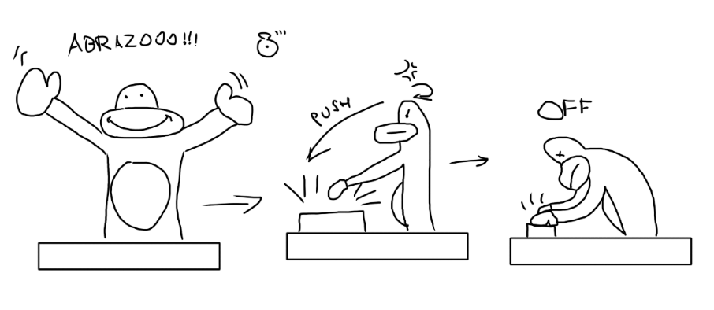

# sesion-13b

LLegue tarde este dia y me tuve que poner al corriente con los apuntes de mis compañeros y en que estabmos del proyecto. 

## Idea desarrollada

El grupo decidió continuar con la idea de la máquina de abrazos propuesta por Carla, desarrollándola con mayor profundidad. El proyecto consiste en un animal que se muestra amable al inicio y pide afecto, pero que, una vez que el usuario lo abraza, se aferra con fuerza y no lo suelta. La metáfora central apunta a la dependencia emocional que surge cuando los humanos domestican animales salvajes: algo tierno que, al ser tomado, se convierte en una responsabilidad afectiva que no se puede ignorar.

### Metáfora y comportamiento

Si el muñeco es dejado en la mesa, comienza a gritar y amenaza con desconectarse o autolesionarse, generando un bucle incómodo de necesidad, chantaje emocional y validación constante. El concepto explora temas como el apego ansioso, el miedo al abandono y cómo el entorno influye en comportamientos dependientes. La intención es crear un objeto que luzca infantil y tierno, pero cuyo comportamiento revele una trampa emocional.

### Componentes actuales

Para avanzar en el proyecto, ya contamos con varios componentes: el parlante con módulo MP3, el sensor ultrasónico, el sensor de presión, tres servos para los brazos tipo claw machine, un botón de arcade falso y cables H–H. Aun así, los profesores recomendaron comprar algunos repuestos por seguridad.

### Propuesta de montaje

Propuse que en vez de ser un animal pensado para ser tomado en brazos, se pueda fijar a una base o placa a modo de teatrillo, funcionando como un objeto expositivo. Esta base no invitaría necesariamente a cargarlo, sino a acercarse, tocarlo e interactuar, reforzando la tensión entre su apariencia tierna y su comportamiento emocionalmente demandante.

