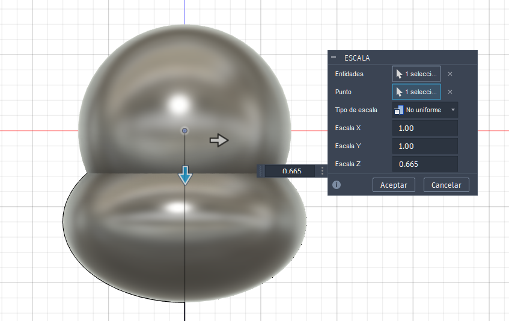
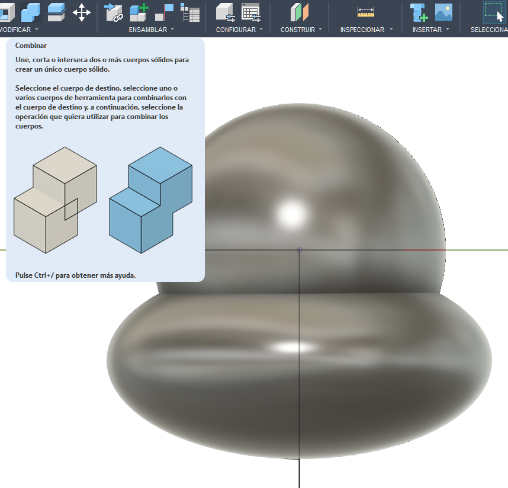
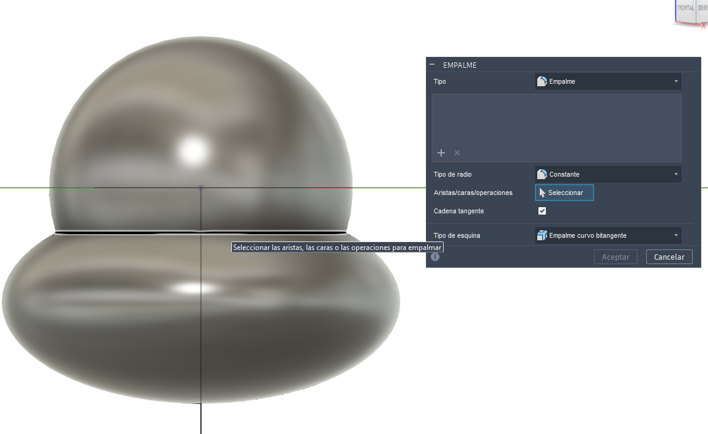
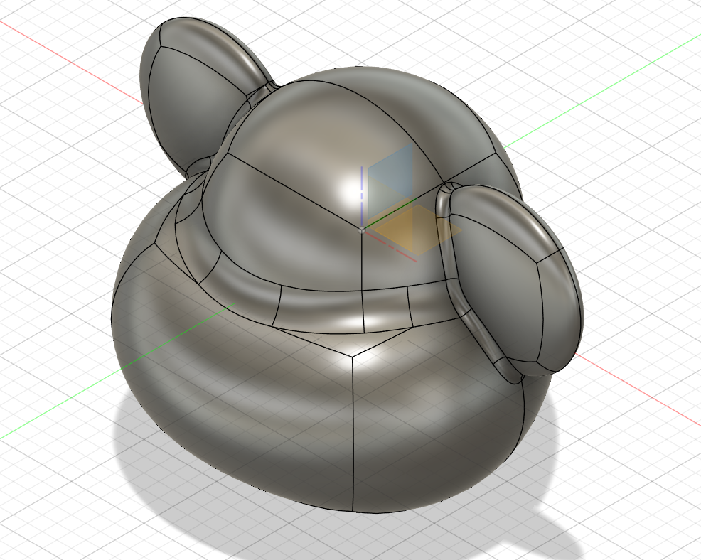

# sesion-14b

Llegué un poco tarde, pero aun así pude trabajar en sintonía con mi grupo.

## Trabajo en clases

Durante la sesión, establecimos que para crear a Jorge utilizaremos telas tipo felpa, ya que nos permiten darle una apariencia suave y tierna, similar a la de un peluche. A partir de esa decisión, me ofrecí a realizar un modelo 3D que nos sirviera como base para generar un patrón más preciso y ordenado.

En un inicio iba a trabajar en Blender, pero no estaba obteniendo los resultados deseados, especialmente en términos de precisión y control de las formas. Por esa razón, y siguiendo la recomendación de Francisco Stephens, opté por utilizar Fusion 360, que me permitió trabajar de manera mucho más exacta y ordenada para crear el modelo que necesitábamos.

Para este proceso también utilicé unos bocetos que había hecho previamente y otros que realizó Carla, los cuales nos ayudaron a definir mejor las proporciones y la forma general de Jorge antes de pasar al modelado digital.

Además, dibujé a mano una plantilla en papel a escala 1:1 para que el grupo pudiera dimensionar el tamaño real que tendrá nuestra mascota. Esto resultó muy útil para visualizar mejor dónde irían las distintas piezas y, sobre todo, para mejorar nuestra comunicación, ya que muchas veces hablar “en el aire” hace que las ideas se dispersen o no se entiendan del todo.

La plantilla permitió que todos tuviéramos una referencia concreta, facilitando la toma de decisiones y alineando nuestra visión del proyecto. Esto hizo que el trabajo avanzara de forma mucho más clara y coordinada.

---

### Fushion 360

Para hacer la pieza del molde de jorge hice lo siguiente: 

1. Creé dos esferas, una ubicada más arriba y otra más abajo.  

2. A la esfera inferior le cambié las proporciones, haciéndola más delgada y ancha usando Scale en modo Non Uniform.
   

3. Luego posicioné ambas y utilicé Modify - Combine con la operación Join para que pasaran a ser un solo cuerpo sólido.

   
4. Para generar una transición suave, usé Modify - Fillet (Empalme).

5. Seleccioné la arista que se formó entre las dos esferas y apliqué el fillet, lo que redondeó y suavizó la unión, creando una conexión continua entre ambas formas. Para lograr la forma de la cabeza de Jorge, repetí los mismos pasos al modelar las orejas.**

6. Se exportó el modelo en formato OBJ para poder prepararlo para impresión.

