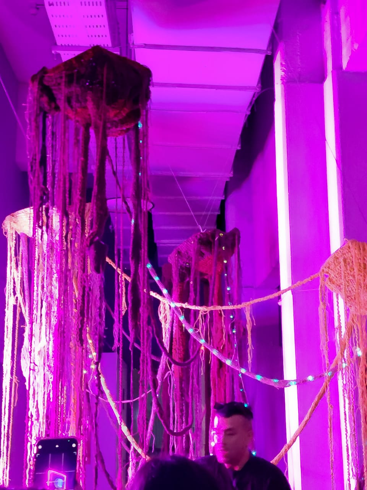
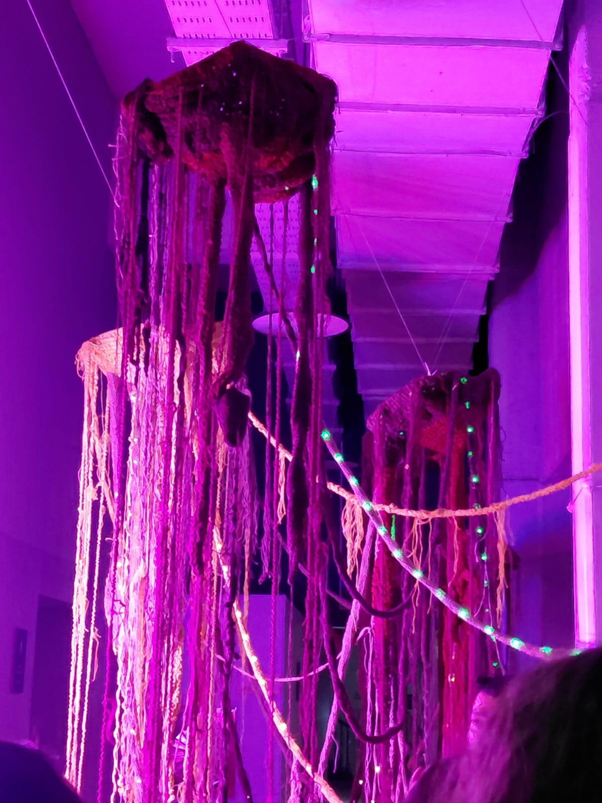

# sesion-11b

## APUNTES EN CLASE

- Máquinas de lenguaje
- Máquinas de felicidad
- Máquinas tra(ns)ductoras → convierten una energía en otra.
- Traducción = palabras
- Transducción = energías
Ensayo de esté
DOO - Diseño Orientado a Objetos
Referencia: **Graham Harman**

> “El enemigo de Graham es el lenguaje… los filósofos que hablan de lenguaje.”
> “Independientemente de cómo llamemos las cosas, van a seguir ahí igual.”

Texto: **La tercera mesa**
> Pregunta central: ¿Qué es una mesa?

- MESA

En programación:

♡︎ clase: mesa

♡︎ Relaciones (capa cultural) → cualidades esenciales

♡︎ En programación: Funciones o métodos (en POO)

♡︎ Materialidades (capa física) → cualidades no esenciales

♡︎ En programación: Variables o atributos (en POO)

── .✦

> Tipos de mirada hacia los objetos

♡︎ Cuando hablamos de los materiales de la mesa: “mesa científica” → overmining (degranar las cosas hacia arriba).

♡︎ Cuando hablamos de las relaciones de la mesa: “mesa humanística” → undermining (degranar hacia abajo).

── .✦

- Conceptos importantes

Asíntota: una línea curva que se aproxima a otra recta pero nunca la toca. No son paralelas porque siempre intenta alcanzarla.

Fenomenología: estudio de cómo las cosas aparecen.

Objeto 1 (no esencial) + Objeto 2 (no esencial) = Metáfora

── .✦

- Trabajo con sentido

Tema: Lenguaje y energía.

Artista: Claudia González Godoy.

♡︎ Conceptos clave:

- Capa discursiva
- Capa metafórica
- Máquinas de lenguaje
- Criptografía
- Transducción (convertir energía en algo)
- Traducciones intersemióticas
── .✦

### ENCARGOS

- Subir una investigación detallada sobre la obra artística de Claudia González Godoy, con énfasis en su trabajo sobre ríos.
Debe incluir:

Premios
Exposiciones
Colaboradores
Estudios
Referencias dentro de su obra

#### Claudia González Godoy

1: Datos biográficos

- Nombre: Claudia González Godoy (Santiago, 1983)
- Formación: Licenciada en Bellas Artes (mención gráfica) por ARCIS; Magíster en Artes Mediales por la Universidad de Chile; diplomada en Lutería Electrónica por la Pontificia Universidad Católica de Chile. Su práctica artística se centra en los cruces entre arte, ciencia, tecnología y naturaleza, explorando la materialidad de soportes analógicos y digitales, además del comportamiento de los materiales en el tiempo y su manifestación sonora.
(<https://casa-hoffmann.com/portfolio/claudia-gonzalez-godoy/>)

2: Tema central e interés por los ríos

- Uno de los ejes fundamentales en su obra es el agua, los ríos y sus correlatos ecológicos y tecnológicos.
- Por ejemplo, la serie “Hidroscopias” aborda la transformación socio-ambiental de ríos chilenos como el Río Biobío.
- Su interés no es solo estético, sino activamente crítico: cuestiona el extractivismo hídrico, la infraestructura de embalses, la alteración del cauce, y cómo todo esto afecta la experiencia sensorial (sonido, memoria, territorio) del río.

(<https://casa-hoffmann.com/portfolio/claudia-gonzalez-godoy/>)
(<https://cchv.cl/charla-y-visionado-de-hidroscopia-biobio-arte-tecnologia-y-ecologia-critica-en-el-mssa/>)
(<https://chaco.cl/galeria-gabriela-mistral-presenta-decantaciones-y-resonaciones-donde-nace-y-termina-el-rumor-del-rio/>)

3: Premios, exposiciones y colaboraciones

- Obra incluida en colecciones nacionales e internacionales, como el ifa Gallery y el ZKM Karlsruhe (Alemania).
- Participación en la 15ª Bienal de Artes Mediales de Santiago con la obra “Hidroscopia / Loa”.
- Exposición “Hidroscopia / Biobío” en 2025: proyecto interdisciplinario con equipo de colaboradoras/es, interviniendo el río Biobío.
- Colaboradores en este proyecto: Bárbara Molina Vega, Susana Chau Ahumada, Andrés Morales Durán, Arturo Barra Henríquez, curadora Carolina Castro Jorquera.

(<https://casa-hoffmann.com/portfolio/claudia-gonzalez-godoy/>)
(<https://www.claudiagonzalez.cl/projects/hidrosciopia-loa-cu/>)
(<https://cchv.cl/charla-y-visionado-de-hidroscopia-biobio-arte-tecnologia-y-ecologia-critica-en-el-mssa/>)

4: Estudios y referencias en su obra

- Realiza trabajo de campo, recolecta muestras de agua, sedimentos, registros sonoros y audiovisuales.
- Usa tecnología, electrónica DIY y materiales orgánicos/minerales para construir instalaciones sonoras que reflejan el “estado” de los ríos intervenidos.
- Su metodología articula arte, ecología, tecnología y comunidad: se involucra con territorios, colectivos y reconoce la memoria biocultural como componente clave.

(<https://arteymedios.org/claudia-gonzalez/>) (<http://revistas.uach.cl/index.php/retd/article/view/7774/8778>)

> Fotos tomadas en la visita que hicimos

── .✦

- Subir una taxonomía detallada de sensores, actuadores, software y hardware utilizados en una obra exhibida en la Bienal de Artes Mediales 2025, citando correctamente todas las fuentes.

♡︎ **Obra en la 17ª Bienal de Artes Mediales de Santiago (2025)**

1. Contexto de la Bienal
La 17ª Bienal de Artes Mediales de Santiago – “Hiperrealidades” – se realizará del 9 al 26 de octubre de 2025, con curaduría de Nicolás Oyarce Carrión.
El evento se presenta como un espacio de exhibición, investigación y creación donde convergen artes, ciencias, tecnologías y sociedad.

(<https://17.bienaldeartesmediales.cl/>)

2: Obra seleccionada para la taxonomía

**~~~ desde la raíz ~~~ una aproximación al bosque esclerófilo ~** por Yto Aranda

♡︎ **Sensores**

- Sensores Táctiles: Detectan el contacto físico del público con la estructura tejida, simulando la sensibilidad del sistema de raíces y permitiendo que el bosque reaccione y responda.

♡︎ **Actuadores**

- Iluminación LED Programable: Actúa como un código o señal visual, controlados por microcontroladores. Responden a la interacción táctil del público para revelar el "funcionamiento interconectado" del sistema de raíces.
- Sistema de Sonido Ambiental (Inferencia): Dispositivos de salida de audio (parlantes) que emiten el sonido ambiental asociado a la vida del bosque y a la red subterránea.
- Elementos olfativos (Difusores/Dispensadores): Mecanismos que liberan olores propios del bosque (el subsuelo, la tierra, las micorrizas), creando una capa de inmersión sensorial.

♡︎ **Hardware**

- Microcontroladores: Dispositivos electrónicos (ej. Arduino, Raspberry Pi) que procesan la señal de los sensores táctiles y controlan los actuadores (LED, sonido, olores).
- Video Proyección: Proyector y superficie de proyección para mostrar el video que documenta visualmente el bosque real.
- Estructura Textil Tejida: El soporte físico principal de la instalación, en el que se integran la tecnología electrónica y los sensores.

(<https://17.bienaldeartesmediales.cl/>)

♡︎ **Software**

- Lenguaje/Entorno de Programación (Inferencia): Código cargado en los microcontroladores (ej. C++ con Arduino IDE, Pure Data) que gestiona la lógica de la interacción.
- Software de Edición de Video/Audio (Inferencia): Programas utilizados para crear el contenido del video y el diseño del sonido ambiental.

Fotos tomadas en la visita que hicimos
