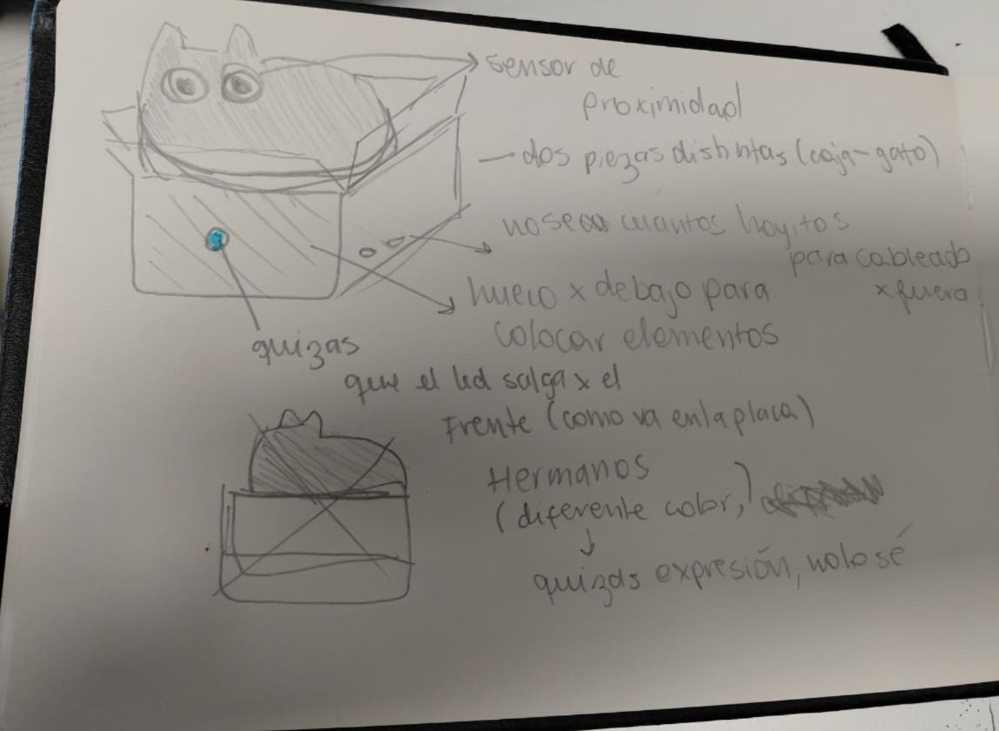
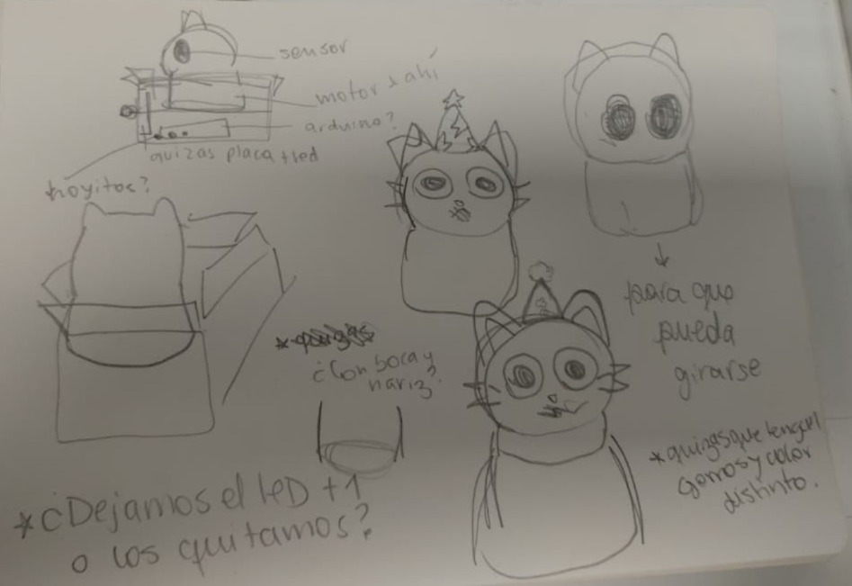

# sesion-13b
## APUNTES 07.11.25 𓆩♡𓆪

⋆. 𐙚 ̊ **FECHAS IMPORTANTES**

* .ᐟ.ᐟ **Examen** 10 de diciembre (miércoles) a las 09:00

* ✶ 21 de noviembre (viernes): **entrega proyecto 3**

── .✦

### ✶ 𓇢𓆸 PROYECTO
- darle trabajo al usuario (ej: girar manivela) ¿contará que el usuario tenga que acercarse/alejarse?
- Con la 1mera propuesta: Estamos rompiendo la linealidad del sensor actuador, estamos pensando con mapping más complejo.
- Con la 2da propuesta: les gustó
- Con la 3ra: ops.

- **En general:** hacer una trilogía(?, variaciones de una idea, más económica, mismos sensores y darles comportamientos distintos, estudio de máquinas sobre presencia? referente (http://zimoun.net/) estudio sobre nosotras, no somos fan de la presencia :).

- **Ahora**: ordenar el hilo conductor, tomar decisiones, ¿haremos tres?, vibrador quizás un poco más grande, como el de mandos playstation, etc.

- Haremos dos para la entrega del 21.
- Máquina de la Ansiedad + Máquina de la verguenza

#### ⋆ 𐙚 ̊. PRESUPUESTOS:

ˎˊ˗ Ambos robots

- Placa arduino uno + cable x2 ✔
- Protoboard (grande) x2 ✔
- Cables macho-macho x2: $1000 (https://afel.cl/products/pack-20-cables-de-conexion-macho-macho) = **2000**

- Sensor ultrasónico x2 (https://afel.cl/products/sensor-de-ultrasonico-hc-sr04) = **3000**
- Motor vibrador PWM Switch DC (1) (https://afel.cl/products/motor-vibrador-pwm-switch-dc) = **2000**
- Módulo Mosfet IRF520 (1) (https://afel.cl/products/modulo-mosfet-irf520) = **2000**
- Micro Servomotor SG90 (1) (https://afel.cl/products/micro-servomotor-sg90) = **1990**
- Diodo Led RGB x15 (https://afel.cl/products/diodo-led-rgb-5mm) = **1500**
- Resistencias 220oms (https://afel.cl/products/kit-600-resistencias-1-4w-30-valores) = **4990**
- **17.480** total

Colocamos también el presupuesto en el excel que nos entregaron.

Hay algunos materiales que pueden estar en el lab, ver luego.

> VER si podemos hacer que las dos interactuen, cómo, no lo sé.

También hicimos ideas de carcasas.

