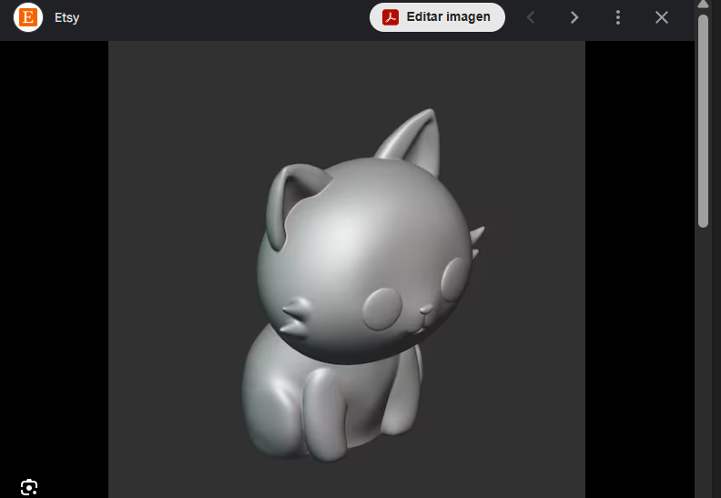
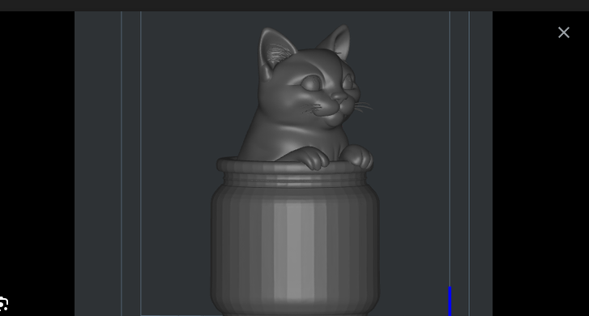

# sesion-14a
## CLASE 11.11.25

* Estuvimos trabajando pseudocódigo en la clase.

* Comprar Motor vibrador PWM Switch DC (Gracias a su diseño con transistor MOSFET de activación por nivel alto, puede ser controlado fácilmente por una señal digital o PWM)

* Sobre el pseudocódigo:
- Los pines 10 (SS_RX) y 11 (SS_TX) sirven para que esta placa Arduino (“Máquina de la Ansiedad”) hable con la otra placa (la “Máquina de la Vergüenza”).

* Sobre la conexión física:
- Ambas deben tener GND común para que la comunicación funcione.

 ✶⋆.˚Los ayudantes nos comentaron que si queremos que ambas placas de arduino interactúen, deben estar unidas por un cable a tierra, y además eso se configura en ambos códigos.

 * También estuvimos buscando ideas de carcasa, ya que queremos continuar con la idea de dos gatitos en cajas, pero no sabemos como realizarlo.
Vimos estos ejemplos en internet:

(https://www.etsy.com/es/listing/1606510392/modelo-3d-de-gato-chibi-archivo-stl)  

(https://cults3d.com/es/modelo-3d/casa/cat-in-a-pot-3d-model-to-print)
