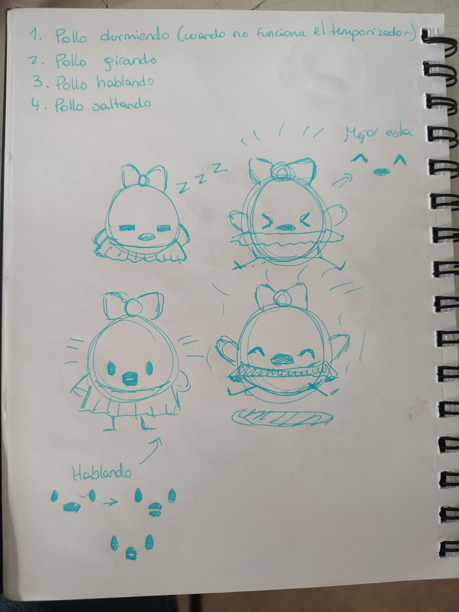
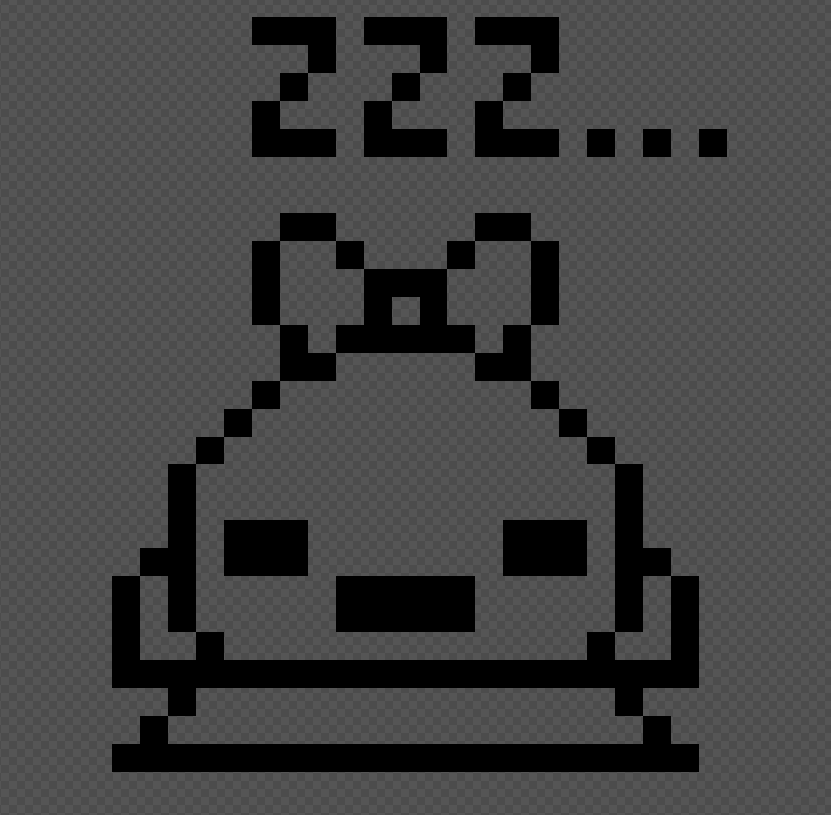
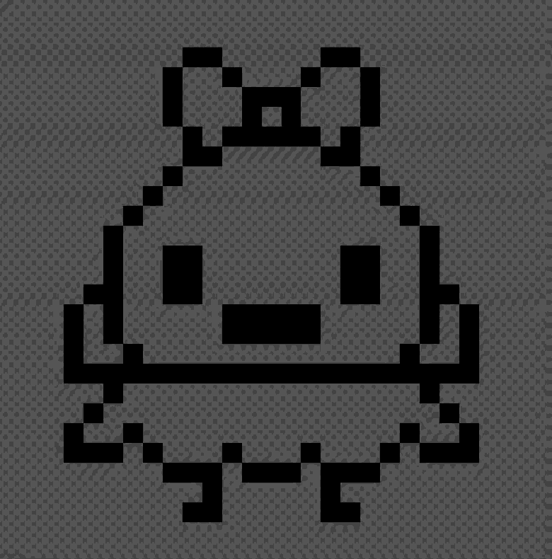
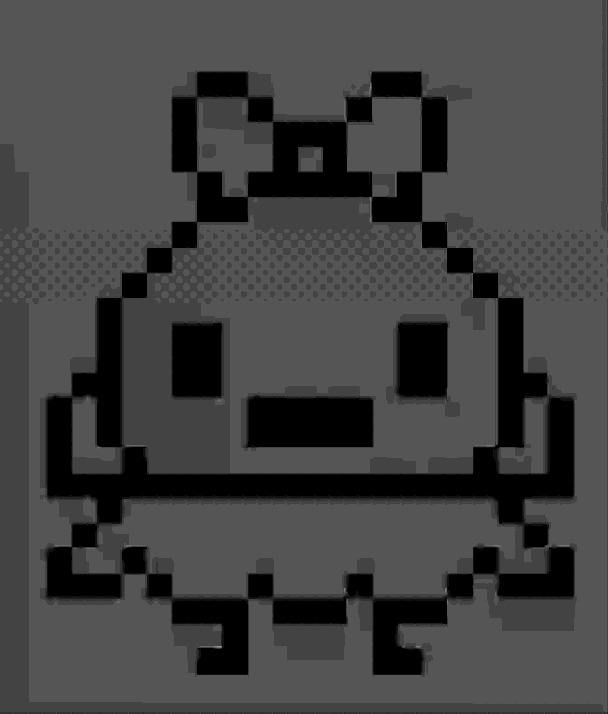

# sesion-14b

14 Noviembre 2025

## Definiendo las pantallas definitivas
Nos pusimos de acuerdo en lo que serían las pantallas definitivas del pollito dentro de la máquina. Lo que decidimos fue:

1. Pollito durmiendo cuando no está habilitado el temporizador
2. Pollo girando o bailando
3. Pollo hablando 
4. Pollo saltando

Además, nos decidimos por un referente para el baile del pollito. Existe el ave del paraíso que tiene un baile de cortejo muy curioso. La forma en que se esponjan sus plumas lo hace parecer una falda. Por lo que esta ave es un buen referente para lo que buscamos.

Aquí estarían los bocetos para lo que sería lo que definimos bien:

Terminé de hacer los frames que decidimos, de acuerdo a lo boceteado anteriormente.

