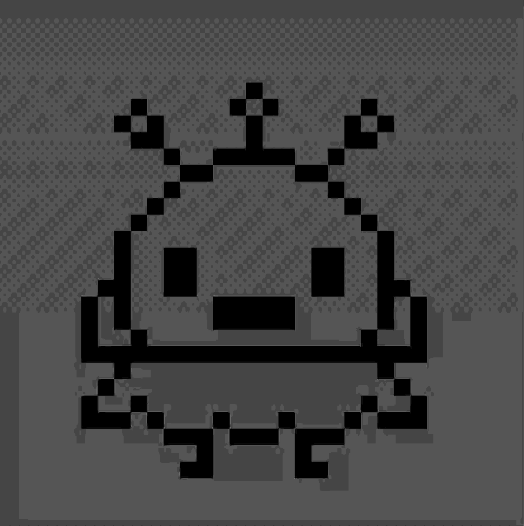
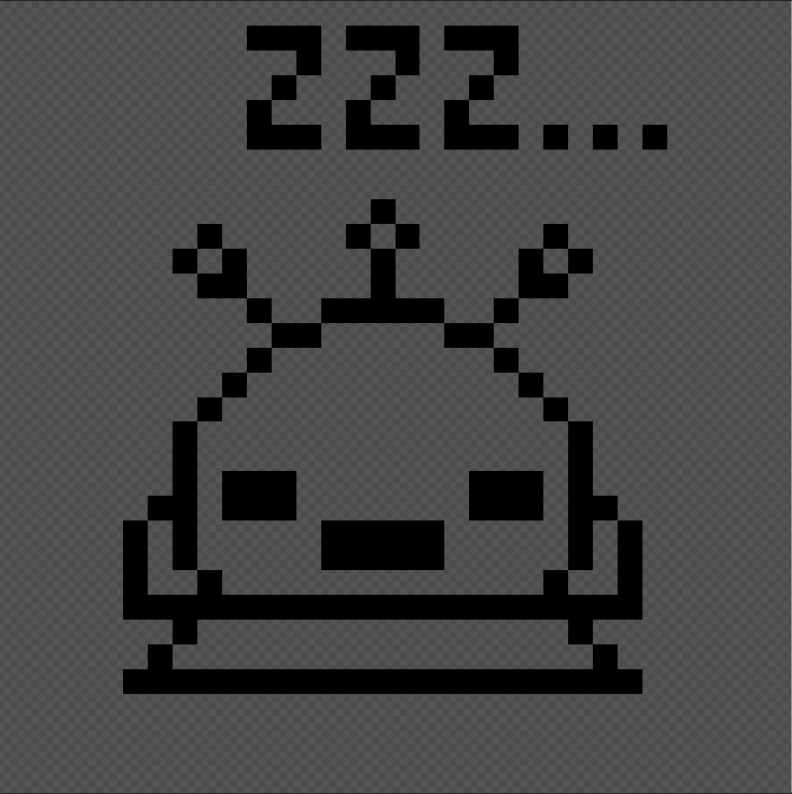
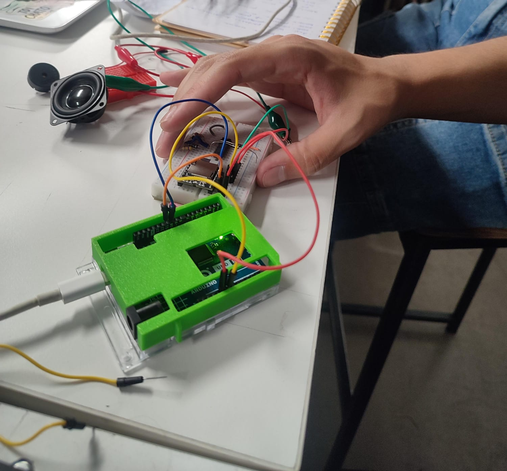

# sesion-15a

18 Noviembre 2025

## Cambios pequeños al pollo
Estuvimos hablando del ave del paraíso que utilizamos como referente para el pollo, y decidimos que sería bueno incorporar las plumas con forma de antena que tiene cuando está haciendo el baile de apareamiento. Por lo que eliminamos la cinta que tenía en la cabeza y la cambiamos por las antenitas. Le da un cierto aspecto de alien que nos gusta mucho.






## Probando distintos parlantes

Para que pueda entrar bien en la carcasa, tenemos que considerar las opciones de parlantes que tenemos, ya que hay varias. Nos pusimos a probar los parlantes durante la clase, pero tuvimos un problema. Por alguna razón no estaba reproduciendo los sonidos, a pesar de que sabíamos que la microSD en el módulo reproductor si tenía los archivos. Tampoco el problema fue el código, ya que anteriormente habíamos utilizado ese mismo código para probar un parlante en la solemne anterior. No sabemos si habrá sido el cableado, porque lo revisamos más de una vez. A veces tenía sonido de estática y el módulo reproductor se sobre calentaba. Por ahora nos enfocaremos en otras cosas antes de continuar con esta parte de nuestro proyecto.




## Investigación y pruebas de display

Nos dividimos algunas de las cosas que hay que probar. Yo elegí particularmente la parte de display. Lo primero que haré es investigar si es posible tener una imagen en bitmap y un texto en la misma pantalla al mismo tiempo. Es decir, combinarlo en el mismo display. En el siguiente link <https://www.electronics-lab.com/project/arduino-nokia-5110-tutorial-2-displaying-customized-graphics/> muestra como usar gráficas personalizadas en la pantalla.
Se debe incluir la biblioteca **LCD5110 graph** por Henning Karlsen para utilizar la pantalla lcd para gráficas. Lo genial de este proyecto que encontré es que explica muy bien paso a paso el código. El autor explica que se debe declarar cada objeto (texto y bitmap) que vamos a utilizar. Nuestro proyecto entonces sería algo así:

```cpp
extern uint8_t texto];
extern uint8_t bitmap1[];
extern uint8_t bitmap2[];
```

Después muestra el código con todas las variables:
```cpp
void loop()
{
  lcd.clrScr();
  lcd.drawBitmap(0,0,pi,84,48);
  lcd.update();
  delay(2000);
  lcd.clrScr();
  lcd.drawBitmap(0,0,icons,84,48);
  lcd.update();
  delay(2000);
  
  lcd.clrScr();
  lcd.drawBitmap(0,0,cube,84,48);
  lcd.update();
  delay(2000);
}

```
Utiliza lcd.clrScr() para limpiar la pantalla cada vez que se quiere mostrar algo distinto. Y mi pregunta: si es que no se utiliza esto, ¿quedarían uno encima del otro?

Este otro proyecto está mostrando más o menos lo mismo que el anterior. <https://www.electronicwings.com/arduino/nokia5110-graphical-display-interfacing-with-arduino-uno>. La diferencia es que muestra un diagrama con los píxeles de las pantallas de un Nokia.


Pensando en que los bitmap funcionan con coordenadas, quizás la misma lógica se puede aplicar a lo que queremos hacer.

Pero esto no me dice realmente si es posible hacer ambos al mismo tiempo. Todas los proyectos y tutoriales que encontré no hablan de eso realmente. Por lo que decidí preguntarle a don ChatGPT si sería posible hacer esto. Respondió que sí, habría que posicionar las coordenadas del bitmap en un espacio, y con setCursor(x , y). Me redirigió hacia la documentación de Adafruit para entender la parte de coordenadas con setCursor(x , y) y drawBitmap(). Además, me confirmó que la biblioteca de Henning Karlsen si es la indicada para este caso, junto con las coordenadas dentro de la pantalla. Pero me preguntó si sería más conveniente tener el texto y la imagen dentro del mismo bitmap. Requeriría mucho testeo para conseguir la posición correcta de varias imágenes con texto. Según don GPT, también está el riesgo de que se mezclen las imágenes con el texto.
Me dio este código de prueba:
```cpp
#include <LCD5110_Graph.h>

// Pines: CLK, DIN, DC, CE, RST
LCD5110 myGLCD(7, 6, 5, 4, 3);

// Bitmap  (48x48 como ejemplo, puedes adaptar)
extern uint8_t miImagen[];  // declaramos que existe

void setup() {
  myGLCD.InitLCD();
  myGLCD.setFont(SmallFont);

  // Limpiar
  myGLCD.clrScr();

  // Mostrar imagen en la parte izquierda
  myGLCD.drawBitmap(0, 0, miImagen, 48, 48);

  // Mostrar texto a la derecha
  myGLCD.print("Hola!", 50, 5);

  myGLCD.update();
}

void loop() {
}

```

Quería hacer esta prueba en wokwi ya que no tengo por el momento un display a mano. El problema es que no puedo porque no tienen para instalar esa biblioteca específica, y para subir una hay que pagar.
En teoria, debería estar usando distintas partes del display pero no lo puedo confirmar por el momento.

Respecto a lo que sería limpiar la pantalla con clrScr(); (o display.clearDisplay(); en este caso) según este tutorial, efectivamente quedarían sobrepuestas los textos o imágenes que queremos mostrar en la página si no se limpia la pantalla.
“El primer paso se hace con la función display.clearDisplay() que no admite ningún parámetro. Si no haces esto, no borrarás la pantalla y escribirás sobre lo que ya esté dibujado.”
<https://content.instructables.com/F4E/BMCW/JTMSUBU6/F4EBMCWJTMSUBU6.pdf>

### RAM de bitmaps

Una parte importante de nuestro proyecto es asegurarnos de que no se nos acabe la RAM. Vamos a utilizar varias imágenes en bitmap, y eso puede afectar el uso de la RAM del Arduino, por lo que hay que estar seguros de que no esté en el límite.
Al parecer Arduino IDE dice cuanta RAM estás ocupando como porcentaje, pero al parecer no es una manera confiable de revisarlo, ya que no considera las imágenes o cualquier string que se esté utilizando.

<https://forum.arduino.cc/t/is-ide-memory-usage-reliable/1190621/6>

“The percentage report simply tells you what it knows at compile-time. For memory, that's Global and static variables only.
'String' class objects use memory space that's allocated at run-time. The compiler has no way of knowing how much that is.”


Encontré una biblioteca de Arduino que te permite saber cuanta RAM estás utilizando y además utilizar menos. Se utiliza la función “freememory()” y debería devolver la RAM que está disponible.
<https://github.com/mpflaga/Arduino-MemoryFree>
Se ocupa la función F() para guardarlo en la memoria Flash. Al parecer hay una diferencia entre la RAM y Flash que aún no consigo entender.


En resumen, según lo que entendí, para evitar que se ocupe demasiada RAM mientras utilizamos los bitmaps hay que guardarlos en Flash.


