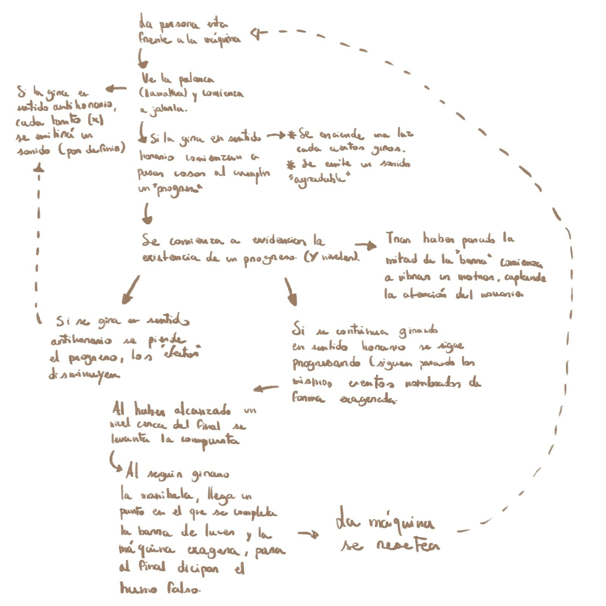

# ⋆₊˚⊹♡ Clase 14a -  ♡⊹˚₊⋆

Martes 11 Noviembre 2025

***

## Observaciones

Este día fue otra sesión de trabajo. Aarón no se presentó al estar trabajando en el montaje de la exposición de "Discusiones contemporaneas del diseño".

***

## Avances personales de la clase

Al llegar, como equipo fuimos hablando más sobre el proceso de la máquina, afinando detalles y llegando a un acuerdo sobre el sistema que serviría para la producción de humo. Tras una charla que tuvimos la clase pasada, es que decidimos usar un médoto que pudiera evadir o limitar los riesgos tanto para el usuario como para los desarrolladores del proyecto, esquivando posibles problemas y accidentes al manipular elementos inflamables.

Es por ello que decidimos usar un ["módulo de humidificador ultrasónico"](https://es.aliexpress.com/item/1005006082732154.html). 

Para poder realizar investigaciones previas basadas en objetos existentes es que decidí traer un Humidificador que tenía en mi casa, además de un "aromatizador automatico" que estaba en desuso para desarmarlo durante la clase.

-> Fotografías de las piezas desarmadas. Recurso personal.

Primero decidimos abrir el aromatizador (imágenes de arriba) dado que era más sencillo al tener tornillos que unen los mecanísmos internos con las capas. Parte del objeto se compone de un motor DC, un botón, un interruptor, una placa controladora (chip), condensadores, resistencias y un portapilas. Además de ello, se encontraron una serie de engranajes plásticos que al girar hacen presión sobre la boquilla de la lata con el contenido aromático. Tal como fue mencionado previamente, esta opción de uso se descartó por el peligro de quemaduras de trabajar con elementos a presión (latas) e inflamables (glicerina, alcohol, combustibles).

Tras ello, se procedió a abrir el humidificador. Puesto que la carcasa del objeto era inaccesible de abrir es que hubo que deformar la entrada micro USB. Tras separar las piezas es que se consiguió la estructura mostrada en las imágenes de abajo. Este módulo se compone de un nebulizador y un circuito con condensadores, resistencias, un botón para encender y apagar, capacitores y chips. Una parte del circuito que es distinto del final es que posee un led integrado que se enciende al mantener el botón presionado por un tiempo.

Esta pieza es clave para el proyecto, por lo que compramos 1 para trabajar con ella la siguiente clase, además de encargar otras 2 a China en caso de que al intervenir la placa esta falle.

-> Imagen del circuito y sus componentes al detalle. Recuperado de [Aliexpress](https://es.aliexpress.com/item/1005006082732154.html)

Además de todo lo mencionado anteriormente, pudimos armar de forma previa 2 esquemas (1 de [Miguel](https://github.com/MiguelVera23) y otro mío) que ayudan a comprender el funcionamiento de la máquina, en conjunto con armar una ["carta Gantt"](https://docs.google.com/spreadsheets/d/17pp08hdp_pM0iXEFMuYERH-XkyRFkypVwBfpVpku7SA/edit?usp=sharing) para poder planificar a gran escala los eventos que irían ocurriendo de forma semanal.

-> Mini esquema del funcionamiento. Recurso personal.

Y para ir cerrando la clase, es que comenzamos a observar códigos de cada parte del circuito, planificando los recursos que usaríamos y cómo el poder implementarlos. [Felix](https://github.com/felix-rg416) fue el primero en ir revisando códigos para poder hacer funcionar el Encoder y ponerlo a prueba.

####

***

### Posdata

A... Tamos por ahí nomas.

***

°˖✧◝(⁰ - ⁰)◜✧˖°
