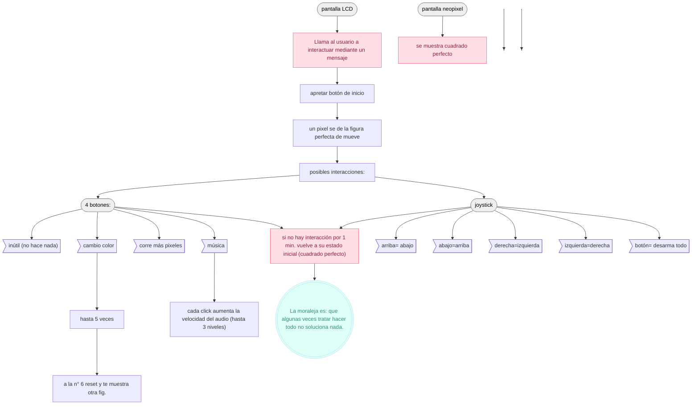

# sesion-14a 11.11.25

```mermaid
---
config:
  theme: default
  look: classic
  layout: fixed
---
flowchart TB
    A(["pantalla LCD"]) --> n2["Llama al usuario a interactuar mediante un mensaje"]
    n2 --> n3["apretar botón de inicio"]
    n4(["pantalla neopixel"]) --> n5["se muestra cuadrado perfecto"]
    n3 --> n6["un pixel se de la figura perfecta de mueve"]
    n6 --> n17["posibles interacciones:"]
    n17 --> n18(["joystick"]) & n19(["4 botones:"])
    n19 --> n20>"inútil (no hace nada)"] & n21>"cambio color"] & n22>"corre más pixeles"] & n23>"música"] & n35["si no hay interacción por 1 min. vuelve a su estado inicial (cuadrado perfecto)"]
    n18 --> n24>"arriba= abajo"] & n25>"abajo=arriba"] & n26>"derecha=izquierda"] & n27>"izquierda=derecha"] & n28>"botón= desarma todo"] & n35
    n21 --> n29["hasta 5 veces"]
    n29 --> n30["a la n° 6 reset y te muestra otra fig."]
    n23 --> n34["cada click aumenta la velocidad del audio (hasta 3 niveles)"]
    n36[" "] --> n37[" "]
    n39[" "] --> n40[" "]
    n35 --> n41["La moraleja es: que algunas veces tratar hacer todo no soluciona nada."]
    n35@{ shape: rect}
    n36@{ shape: anchor}
    n37@{ shape: anchor}
    n39@{ shape: anchor}
    n40@{ shape: anchor}
    n41@{ shape: dbl-circ}
     A:::Ash
     n2:::Rose
     n4:::Ash
     n5:::Rose
     n18:::Ash
     n19:::Ash
     n35:::Rose
     n41:::Aqua
    classDef Sky stroke-width:1px, stroke-dasharray:none, stroke:#374D7C, fill:#E2EBFF, color:#374D7C
    classDef Rose stroke-width:1px, stroke-dasharray:none, stroke:#FF5978, fill:#FFDFE5, color:#8E2236
    classDef Ash stroke-width:1px, stroke-dasharray:none, stroke:#999999, fill:#EEEEEE, color:#000000
    classDef Aqua stroke-width:1px, stroke-dasharray:none, stroke:#46EDC8, fill:#DEFFF8, color:#378E7A
    style n41 stroke:#BBDEFB
```
