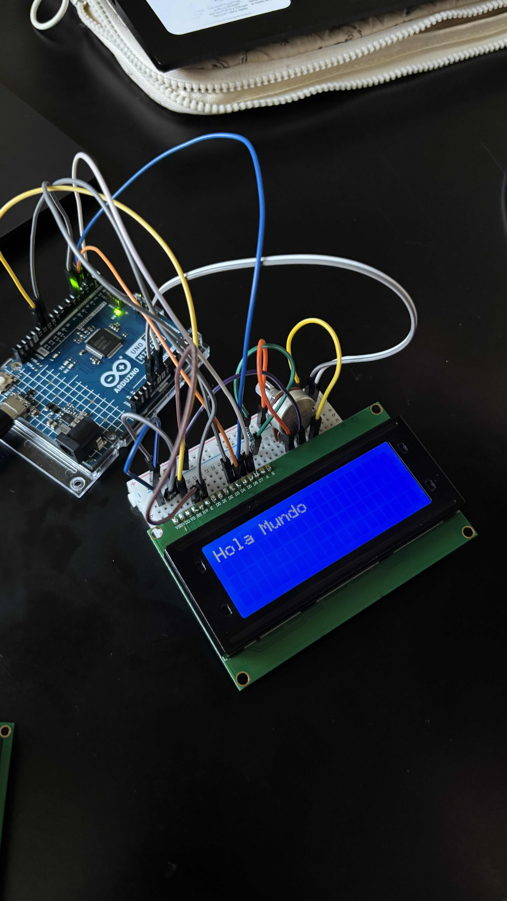
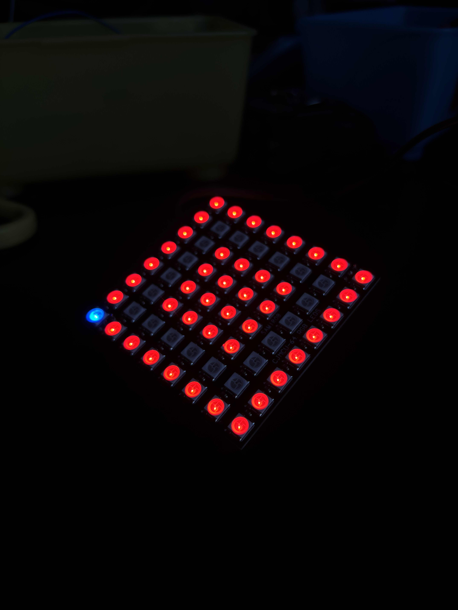

# sesion-14b 14.11.25

## Game over
No está hecha para ganar.

+ Está compuesta por una pantalla de 8x8 píxeles, un joystick, dos botones y un potenciómetro. En la pantalla LCD muestra de "Acércate y juega" mientras que en la pantalla neopixel aparece una figura perfectamente formada: Un cuadrado. Pero al apretar inicio el juego, algo se rompe. Un píxel se mueve, y la figura deja de ser perfecta. Desde ese momento, el usuario intenta repararla… aunque la máquina nunca lo permitirá.

### Controles
  
+ **Joystick:** Mueve los píxeles, pero en dirección contraria a la que intentas. (aariba es abajo, izquierda es derecha)
+ **Botón del joystick:*** Desarma todo, se reparten los pixeles por toda la pantalla.
+ **Botón de inicio:** Le da inicio al juego moviendo un pixel de su lugar cuando la figura está perfecta.
+ **Botón 1:** Inútil, no hace nada.
+ **Botón 2:** Cambia el color del LED que no está en sun lugar hasta 5 veces, a la 6ta vez la pantalla se invierten los colores (la figura queda sin color y el fondo con color)
+ **Botón 3:** Música, cada click aumenta la velocidad del audio (hasta 3 veces).
+ **Botón 4:** Desplaza 2 pixeles de su lugar a uno aleatorio.


### Concepto
**Game over** es una experiencia interactiva que explora la frustración y la imposibilidad de alcanzar la perfección.
Cada intento por “arreglarla” solo genera más caos.

#### Código trabajado en clases

```cpp
#include <Adafruit_NeoPixel.h>

// ================= CONFIGURACIÓN GENERAL =================
#define PIN_MATRIZ 6
#define NUM_PIXELES 64  // 8x8

#define PIN_JOYSTICK_X A0
#define PIN_JOYSTICK_Y A1
#define PIN_JOYSTICK_BOTON 2   // botón del joystick (modo disco)

#define PIN_INICIO 8           // libera pixel escapado desde el cuadrado
#define PIN_COLOR  9           // cambia color del pixel escapado infinitamente

Adafruit_NeoPixel matriz = Adafruit_NeoPixel(NUM_PIXELES, PIN_MATRIZ, NEO_GRB + NEO_KHZ800);

// ================= VARIABLES DEL JUEGO ==================
bool formaBase[64] = {    // cuadrado perfecto inicial
 0,0,0,0,0,0,0,0,
 0,1,1,1,1,1,1,0,
 0,1,0,0,0,0,1,0,
 0,1,0,0,0,0,1,0,
 0,1,0,0,0,0,1,0,
 0,1,0,0,0,0,1,0,
 0,1,1,1,1,1,1,0,
 0,0,0,0,0,0,0,0
};

int pixelBloqueado = -1;
int pixelEscapado = -1;

uint32_t colorPixelEscapado = 0x00FFFF;

bool modoDisco = false;
unsigned long tiempoUltimoMovimiento = 0;
const unsigned long retrasoMovimiento = 200;

const unsigned long retrasoDisco = 80;

// ================= FUNCIONES UTILES ==================
int obtenerX(int indice) { return indice % 8; }
int obtenerY(int indice) { return indice / 8; }
int obtenerIndice(int x, int y) { return y * 8 + x; }

// Genera colores aleatorios que NO sean rojo fuerte
uint32_t generarColorNoRojo() {
  while (true) {
    int r = random(0,256);
    int g = random(0,256);
    int b = random(0,256);
    if (!(r > 200 && g < 80 && b < 80)) {
      return matriz.Color(r,g,b);
    }
  }
}

// Dibuja el estado normal del juego
void dibujarMatrizNormal() {
  matriz.clear();

  for (int i = 0; i < NUM_PIXELES; i++) {
    if (formaBase[i] == 1) matriz.setPixelColor(i, matriz.Color(255,0,0)); // rojo
  }

  // Dejar apagado el pixel bloqueado
  if (pixelBloqueado >= 0) matriz.setPixelColor(pixelBloqueado, 0);

  // Dibujar pixel escapado
  if (pixelEscapado >= 0) matriz.setPixelColor(pixelEscapado, colorPixelEscapado);

  matriz.show();
}

// Frame de modo disco (sin bloquear el pixel bloqueado)
void dibujarMatrizDisco() {
  for (int i = 0; i < NUM_PIXELES; i++) {
    matriz.setPixelColor(i, generarColorNoRojo());
  }

  // Pixel escapado por encima para distinguirlo
  if (pixelEscapado >= 0) matriz.setPixelColor(pixelEscapado, colorPixelEscapado);

  matriz.show();
}

// =================== SETUP ======================
void setup() {
  matriz.begin();
  matriz.show();
  randomSeed(analogRead(A3));

  pinMode(PIN_INICIO, INPUT_PULLUP);
  pinMode(PIN_COLOR, INPUT_PULLUP);
  pinMode(PIN_JOYSTICK_BOTON, INPUT_PULLUP);

  dibujarMatrizNormal();
}

// =================== LOOP ======================
void loop() {
  // ---- BOTÓN INICIO (solo la primera vez) ----
  if (pixelEscapado < 0 && digitalRead(PIN_INICIO) == LOW) {

    int candidatos[6] = {
      obtenerIndice(6,1), obtenerIndice(6,2), obtenerIndice(6,3),
      obtenerIndice(6,4), obtenerIndice(6,5), obtenerIndice(6,6)
    };

    int elegido = random(6);
    pixelBloqueado = candidatos[elegido];
    formaBase[pixelBloqueado] = 0;

    pixelEscapado = pixelBloqueado + 1;

    dibujarMatrizNormal();
    delay(250);
  }

  // ---- BOTÓN CAMBIO DE COLOR ----
  if (pixelEscapado >= 0 && digitalRead(PIN_COLOR) == LOW) {
    colorPixelEscapado = generarColorNoRojo();
    dibujarMatrizNormal();
    delay(200);
  }

  // ---- MODO DISCO TOGGLE ----
  static int ultimoEstadoBoton = HIGH;
  int estadoActualBoton = digitalRead(PIN_JOYSTICK_BOTON);

  if (ultimoEstadoBoton == HIGH && estadoActualBoton == LOW) {
    modoDisco = !modoDisco;
    delay(200);
  }
  ultimoEstadoBoton = estadoActualBoton;

  // ---- ANIMACIÓN DISCO ----
  if (modoDisco) {
    dibujarMatrizDisco();
    delay(retrasoDisco);
    return;
  }

  // ---- MOVIMIENTO DEL PIXEL ESCAPADO ----
  if (pixelEscapado >= 0) {

    int valorX = analogRead(PIN_JOYSTICK_X);
    int valorY = analogRead(PIN_JOYSTICK_Y);

    if (millis() - tiempoUltimoMovimiento >= retrasoMovimiento) {

      int x = obtenerX(pixelEscapado);
      int y = obtenerY(pixelEscapado);

      if (valorX > 800 && x > 0) x--;
      else if (valorX < 200 && x < 7) x++;

      if (valorY > 800 && y > 0) y--;
      else if (valorY < 200 && y < 7) y++;

      int nuevaPosicion = obtenerIndice(x,y);

      if (nuevaPosicion != pixelBloqueado) {
        pixelEscapado = nuevaPosicion;
      }

      dibujarMatrizNormal();
      tiempoUltimoMovimiento = millis();
    }
  }
}
```




