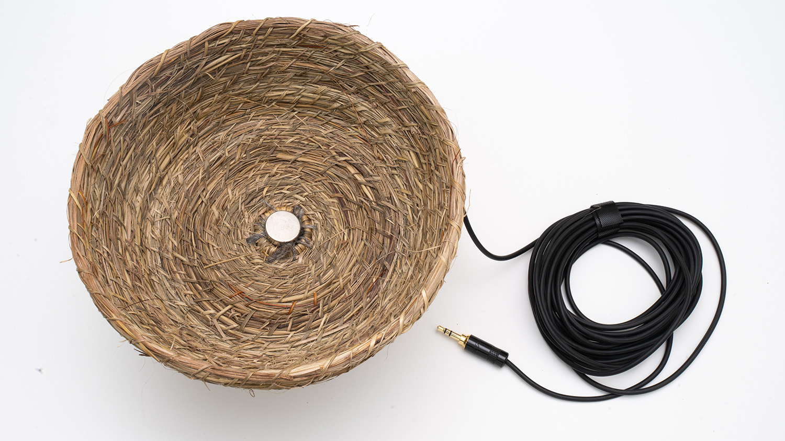
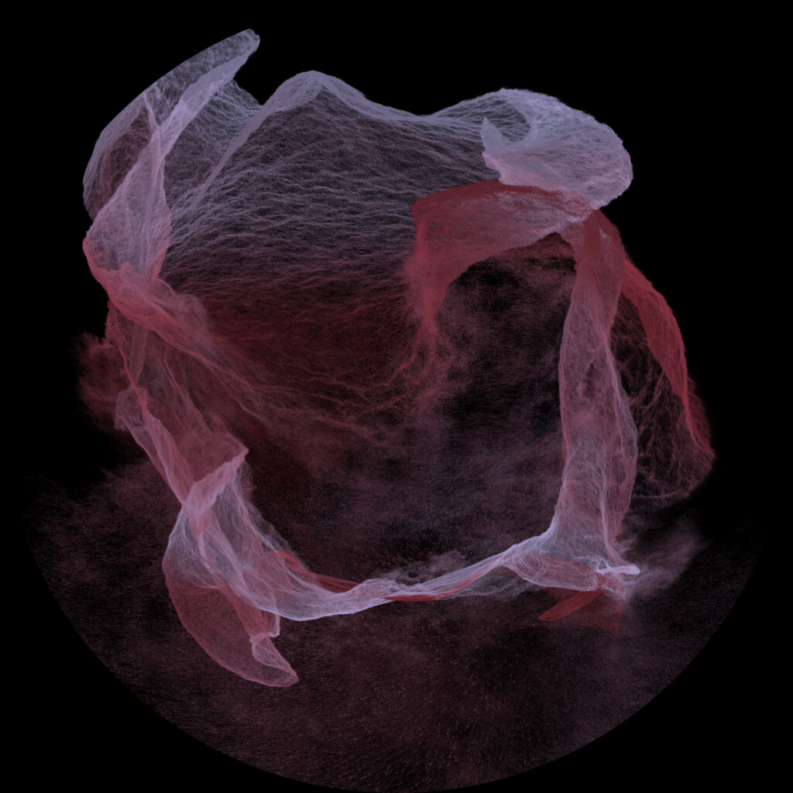

# sesion-11b
24/10/25

- Máquinas de lenguaje
- Máquinas de felicidad
- Máquinas tra(ns)ductora

transducción -> convertir energía en otra.

Graham Harman -> Filósofo 

Cosmología: Rama de la física y la astronomía que estudia el universo en su conjunto, incluyendo su origen, evolución, estructura y destino.

Programación orientada a objetos.

Mesa Humanista -> overminig

Mesa científica -> underminig

La mesa real aparece cuando falla.

Un buen diseño es el que pasa desapercibido. -> Esto podría aplicarse al diseño gráfico?, cuando lo que se espera es, ser visto y no volverse invisible.

Asíntota: línea recta a la que una curva se acerca indefinidamente sin llegar a tocarla nunca.

OOO -> Ontología orientada a objetos
DOO -> Diseño orientado a objetos
POO -> Programación orientada a objetos

Fenomenología: Enfoque filosófico que estudia la experiencia vivida de la conciencia, centrándose en cómo se manifiestan los fenómenos y su significado para las personas. Su objetivo principal es describir la estructura de la experiencia humana desde el punto de vista de la primera persona, sin intentar explicarla en términos de causas externas, sino comprendiendo cómo las cosas aparecen y son percibidas por los individuos.

## Salida a terreno
Como curso fuimos a una visita de dos obras. La primera que visitamos fue "Decantaciones y Resonancias" de Claudia Gonzalez Godoy en el la galería Gabriela Mistral. Esta era una instalación sonora que recorre el río Biobío desde su nacimiento hasta su desembocadura, revelando las huellas invisibles que deja la intervención humana en sus aguas.

La segunda visita fue a la bienal de artes mediales en el centro cultural CEINA. Esta exposición combinaba diversas disciplinas artísticas y audiovisuales, que exploraban conceptos relativos a las tecnologías del presente. Esta visita estuvo acompañada con una curatoría de Nicolás Oyarce, quién invita a reflexionar sobre el papel político y ético de las artes mediales como espacio de disputa para distintas justicias: ambiental, racial, de género, intergeneracional y ecológica.

## Encargos 
- Encargo 17: "cada persona debe subir una investigación detallada de la obra artística de Claudia González Godoy, con énfasis en su investigación sobre ríos, incluyendo información sobre premios, exposiciones, colaboradores, estudios y referencias en su obra."

- Encargo 18: "cada persona debe subir taxonomía detallada de sensores, actuadores, software y hardware utilizado en 1 obra exhibida en la Bienal de Artes Mediales 2025, citando correctamente a las fuentes."

### Decantaciones y Resonancias
La obra reflexiona sobre las transformaciones que ha sufrido este cuerpo de agua poniendo su atención en el sonido, capturando grabaciones de su flujo libre y contrastándolas con el silencio de las aguas retenidas. La muestra, que ocupa ambas salas de la galería, es el resultado de una investigación artística y ecológica, en la que la artista realizó performances sonoras a lo largo del curso del río, desde su nacimiento en la Laguna Galletué hasta su desembocadura en la Península de Hualpén.

“Esta exposición concluye un proceso de investigación en el Río Biobío que ha durado alrededor de dos años”, señala la artista Claudia González Godoy. “Me gustaría que las y los visitantes puedan encontrar un momento de calma en este espacio. Si bien la obra demuestra una realidad artificiosa y te sitúa en una topografía que simula un embalse, en contraste con eso la invitación es a pensar en el río como un órgano geográfico vital”.

Como parte de la instalación, una representación de la red hidrográfica del Biobío impresa sobre tela, sirve como un mapa que ayuda a visualizar la interrupción de su cauce en los embalses de Ralco, Pangue y Angostura.

Claudia González Godoy (Chile, 1983) es artista medial independiente y gestora de proyectos educativos en arte y tecnología. Su obra se centra en la materialidad de soportes tecnológicos, tanto analógicos como digitales, y en el comportamiento de los materiales en el tiempo y su manifestación en el sonido. A lo largo de su carrera, ha explorado las relaciones entre arte, naturaleza y tecnología, desarrollando metodologías de investigación y producción centradas en el agua, los ríos y la tierra. Su trabajo forma parte de colecciones de instituciones nacionales e internacionales como el MINCAP Chile, ifa Gallery y ZKM Karlsruhe en Alemania, y ha participado en festivales y bienales internacionales como Tsonami, FILE (Brasil) y la Bienal de Artes Mediales.

fuente: https://galeriagm.cultura.gob.cl/noticias/claudia-gonzalez-presenta-decantaciones-y-resonaciones-donde-nace-y-termina-el-rumor-del-rio/

### Kokkino
- Leticia Almeida (Tanky) Mathías Chumino (C03RA)
- Año: 2023
- País: Uruguay
- Formato: Instalación de video formato 9:16
- Lugar: Centro Cultural CEINA
- Fecha: 09/10/2025 - 26/10/2025
- Público: Todo público
  
“Kokkino” es un video generativo e infografía que transforma datos climáticos de código abierto en arte visual orgánico y en constante evolución. Situada en la intersección entre arte, ciencia y tecnología, es tanto una experiencia estética como un llamado a enfrentar la crisis climática. Su nombre proviene de la palabra griega para rojo y remite al lenguaje cromático de las advertencias: una alarma visual ante la aceleración de la emergencia climática.

Impulsada por bases de datos climáticas abiertas, Kokkino traduce estadísticas objetivas en paisajes visuales y emocionales. Un denso sistema de partículas evoca tanto la inmensidad de lo macro como la complejidad de lo micro (como es arriba, es abajo). Su movimiento generativo recuerda a las corrientes oceánicas y atmosféricas, que se transforman en respuesta directa a las fluctuaciones de temperatura. Los registros más fríos se representan en blancos azulados; que al calentarse se tornan rojos profundos, y culminan en el escarlata intenso de récord de temperatura de los años recientes.

En esta transformación de datos en movimiento y color, los números fríos y objetivos adquieren un lenguaje más humano. “Kokkino” invita a reconocer y presenciar el cambio climático.

En octubre y noviembre de 2023 “Kokkino” fue exhibida en Montevideo, Uruguay, y ganó el Primer Premio del llamado Datos+Arte 2023, organizado por el Banco Interamericano de Desarrollo (BID) y la conferencia ABRELATAM/CON DATOS.También se expuso en noviembre de 2023 como parte del Festival de Datos en Punta del Este, Uruguay

fuente: https://17.bienaldeartesmediales.cl/obra/kokkino/ 

