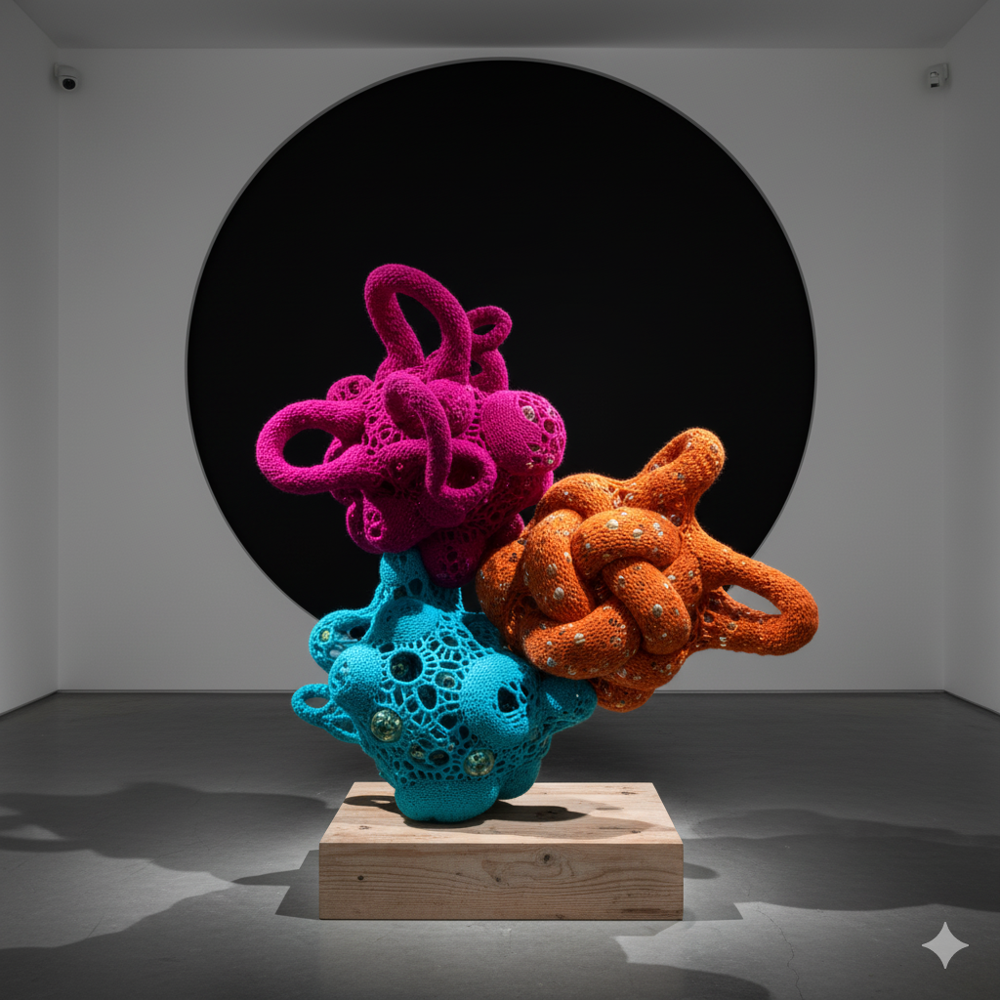
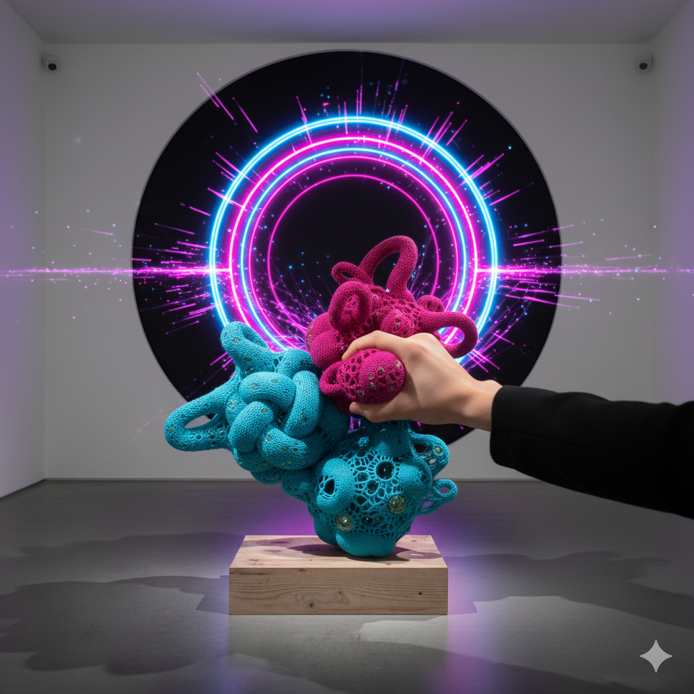
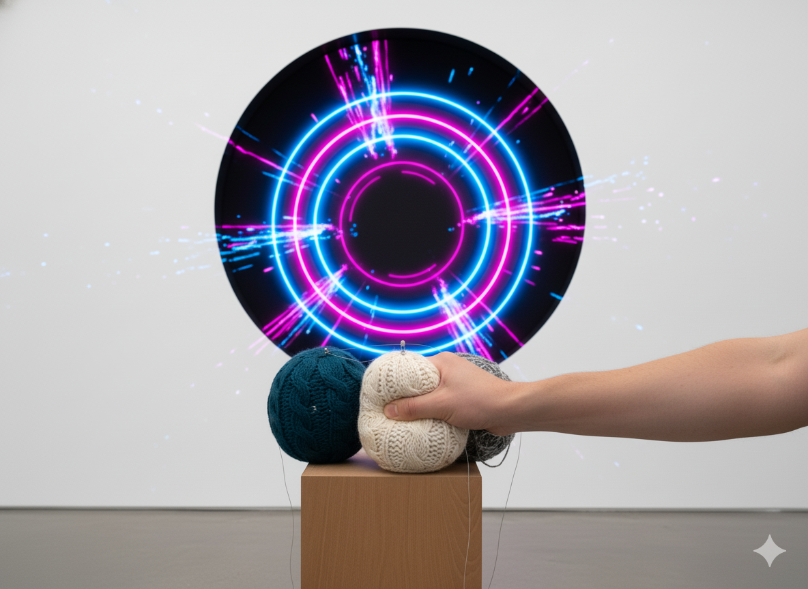

# sesion-13b
07/11/25
## Teloneo
- Una de las cajas de misaa explotó o algo así
- A aarón se le cortó la luz por la lluvia
- El proyecto se entrega en dos semanas más,  21 de noviembre
  
Cierre telón 
## Revisión de proyectos
Explayar y explorar. 

Investigar materiales, referentes y distintos tipos de comunicación. El lenguaje no se limita a hablar con palabras. Se trata de ruido, muecas, señas, acciones. Personalemte me interesa mucho trabajar distintos tipos de comunicación. Cómo se comunican los perros, las personas con parálisis cerebral, las sordociegas, ¿cómo interactúan con el mundo las personas sordas?, es el ruido algo que solo se puede esuchar o es capaz de sentirse?.

Descripción general del proyecto: 

Máquina Reactiva

En estado de reposo, la máquina se mantiene inmóvil y silenciosa. Su forma y materiales invitan al acercamiento: hay algo en su presencia que despierta curiosidad. “La curiosidad mató al gato… y llevó al usuario a interactuar con la máquina para descubrir su reacción.”

Al ser apretada, estirada o acariciada, la máquina despierta. Cada gesto activa una respuesta distinta, expresada a través de gráficas y sonidos sincronizados con la acción del usuario.

Cuando la interacción cesa, la actividad visual y sonora disminuye gradualmente durante unos 5 segundos, hasta que la máquina retorna a su quietud original, como un organismo que exhala y se repliega en sí mismo.

Lógica de Interacción:

1. La máquina comienza en reposo y sin sonido.

Su apariencia y materialidad despiertan curiosidad en el espectador.

2. El usuario se aproxima y decide tocarla.

Puede realizar una de tres acciones:

Apretar (15 segundos)

Estirar (15 segundos)

Acariciar (15 segundos)

Cada acción activa una respuesta específica de gráficos y sonido.

Si se inicia una nueva acción, la anterior se desactiva automáticamente, garantizando que cada gesto mantenga su propio ciclo.

4. Al finalizar la interacción, la máquina reduce su actividad progresivamente (5 segundos).

5. Finalmente, vuelve a su estado de reposo, lista para reiniciar la experiencia.

## bocetos 

## Referentes 
https://makeymakey.com/?srsltid=AfmBOooPVbPm5Y26-2KCGTaZ1RK7S4gUCxgDu_IUC4Q0l3b--yD_Dvq3

https://vimeo.com/174803121

https://michellevossen.com/
