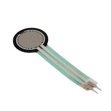
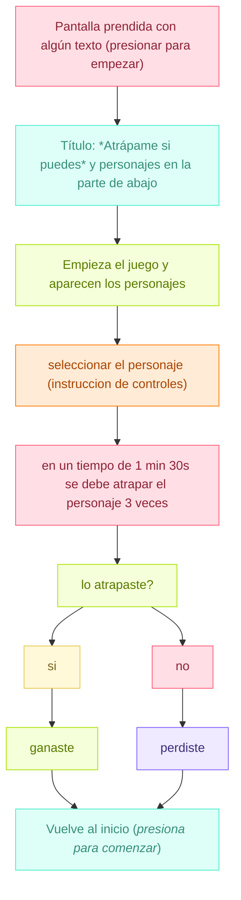
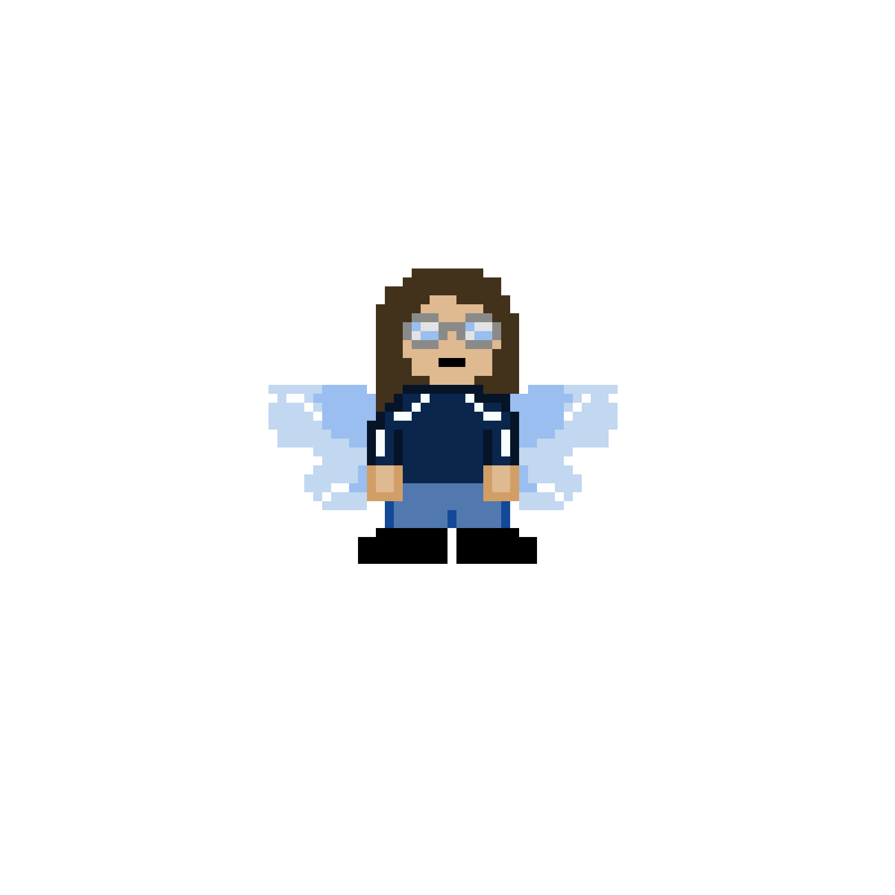
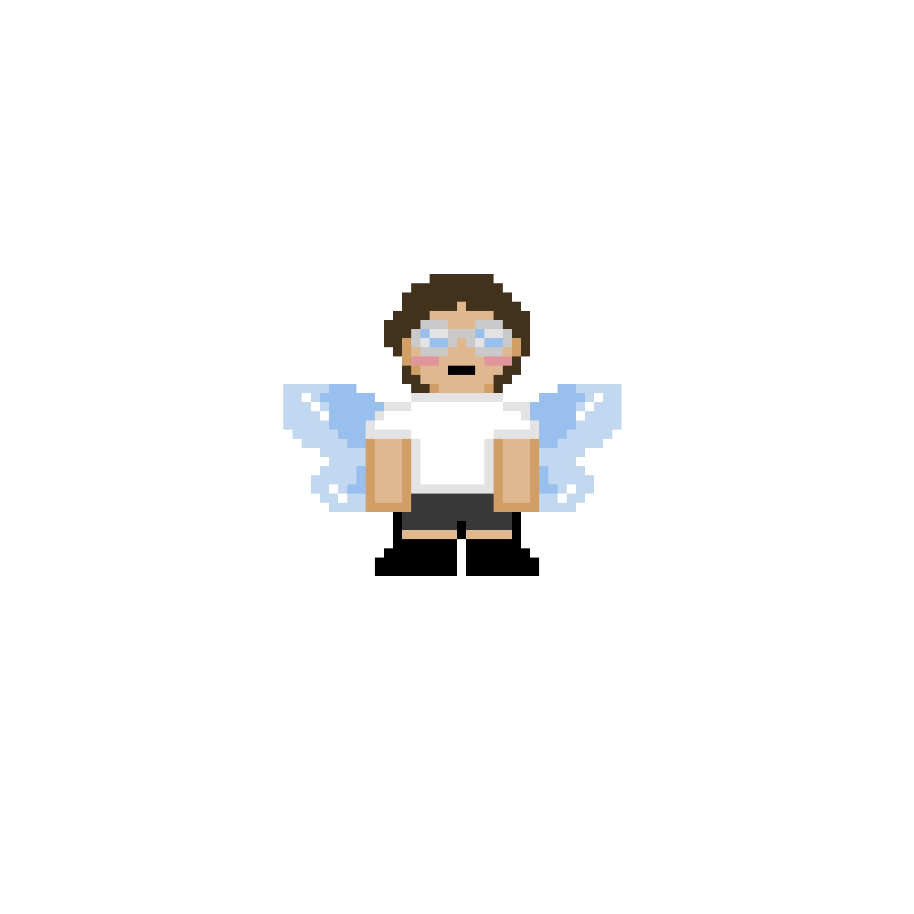
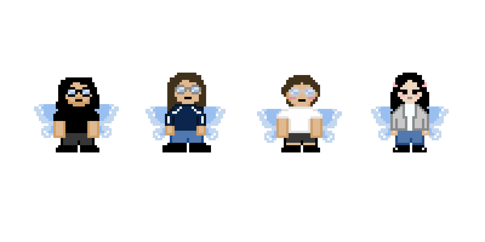

# sesion-15a
18-11-2025
## Apuntes

- Martes 25 día de paseo
  - 09:30 metro salvador
  - 11:00 MAC parque forestal
- Viernes 28 trabajo en clases, última sesión
- El proyecto tiene que ser específico
- Miércoles 26 charla Mateo
  
---

¿Cómo conectar p5.js a Arduino?

- Para conectar p5.js con Arduino, necesitamos una aplicación intermedia como p5.serialcontrol o `Node.js, que actúe como servidor serial y luego usar la biblioteca p5.serialport en tu código p5.js.
- Si queremos conectar el controlador de p5.js directamente con arduino para luego interactuar con p5.js nuevamente, necesitaremos una placa usb host y una biblioteca llamada `USB Host Library 2.0`

Entrada serial a p5.js usando la biblioteca p5.serialport:

[Entrada Serial a P5.js](https://itp.nyu.edu/physcomp/labs/labs-serial-communication/lab-serial-input-to-the-p5-js-ide/#:~:text=El%20boceto%20p5.,js&text=Al%20ejecutar%20este%20sketch%20p5,escuchar%20algunos%20datos%20seriales%20entrantes.)

## Nuevo proyecto 
Como grupo tuvimos un debate sobre el proyecto y como nos sentiamos al respecto. La conclusión fue que ninguna estaba satisfecha al 100% con el proyecto que estabamos planteando, por lo que decidimos darle una vuelta y llegamos a una nueva idea de proyecto que nos emocionara y motivara a todas.

MÁQUINA SENTIMENTAL "ATRÁPAME SI PUEDES"

`SENTIMIENTOS:`
- frustración
- dominar (tener el control)
- dirigir
- competitividad


### Presentación textual 
es una máquina interactiva que funciona con sensores de fuerza, presentado como botones. El usuario escoge su personaje antes de empezar la partida (para el examen). El objetivo del juego es alcanzar (atrapar) este personaje, usando los controles.

Pero el juego está diseñado para que el personaje se escape justo cuando estás a punto de atraparlo. Esto mezclado con la dificultad de usar el control, el cual será no será ergonómico (estará al revés), provoca una mezcla de frustración y risa, porque el error estará en la complejidad y comodidad del usuario.

La interacción crea una especie de competencia emocional entre el usuario y la máquina.

`METÁFORA:`
- La máquina es una traducción tecnológica de ese logro que siempre parece estar a punto de alcanzarse, pero que se escurre por un detalle absurdo. Representa esa experiencia humana en la que todo está listo para que algo resulte bien, pero un gesto mínimo rompe la promesa del éxito.

En el juego, atrapar al personaje es totalmente posible, pero la dificultad surge del propio sistema, que sabotea suavemente al jugador con controles que funcionan al revés. Esa desorientación provoca una frustración cómica, una especie de torpeza inevitable que pone al jugador en el límite entre el control y el caos.

La máquina encarna ese desajuste permanente: el cuerpo quiere avanzar hacia un objetivo claro, pero la interfaz responde de forma caprichosa. En ese choque entre intención y mecanismo aparece el humor, la autoconciencia y la sensación de estar participando en un pequeño teatro donde el esfuerzo, por más sincero que sea, nunca se alinea del todo con el resultado. Es un recordatorio lúdico de cómo incluso nuestras metas más simples pueden torcerse por detalles ridículos… y aun así seguimos intentándolo.

### Que utiliza:
Sensor de fuerza


El sensor es diseñado para detectar y medir la fuerza aplicada a un objeto, convirtiendo esa fuerza en una señal eléctrica que un sistema puede interpretar, lo que causa un cambio en su resistencia eléctrica y genera una señal proporcional a la fuerza aplicada.

¿Cómo funciona el sensor?

1. Aplicación de Fuerza: Pones peso o empujas el cuerpo metálico.
2. Deformación: El cuerpo metálico se dobla o estira ligeramente. Las galgas pegadas a él se deforman en la misma medida.
3. Cambio Eléctrico: Cuando una galga se estira, su resistencia eléctrica aumenta. Cuando se comprime, su resistencia disminuye.
4. Circuito (Puente de Wheatstone): Estas galgas están conectadas en un circuito especial (Puente de Wheatstone) que convierte esos cambios de resistencia en un pequeño voltaje de salida.
5.Resultado: Cuanto mayor es la fuerza, mayor es el cambio de resistencia, y por lo tanto, mayor es el voltaje de salida.
 
En resumen, el sensor de fuerza utiliza la relación lineal entre la fuerza aplicada, la deformación del material (principio de Hooke), y el cambio de resistencia eléctrica (principio de la galga) para ofrecer una medición precisa de la carga.

¿Cómo se conecta al Arduino?

- FSR extremo 1 -> 5V
- FSR extremo 2 -> A0
- Resistencia 10kΩ extremo 1 -> A0
- Resistencia 10kΩ extremo 2 -> GND

`BILL OF MATERIAL`
| Marca   | Nombre en página web                       | Materiales       | Cantidad | Precio   | Descripción                                                                                                                              | Link |
|---------|---------------------------------------------|------------------|----------|----------|------------------------------------------------------------------------------------------------------------------------------------------|------|
| Afel    | Sensor de Fuerza / Presión FSR402           | Sensor de fuerza | 2        | $7.500   | Rango 0–20 lb, resistencia variable 100kΩ–200Ω, consumo <1mA según resistencias usadas.                                                 | https://afel.cl/products/sensor-de-fuerza-presion-fsr402 |
| Arduino | Arduino UNO R4 WiFi                         | Arduino          | 1        | $38.990  | Microcontrolador RA4M1, conectividad ESP32-S3, matriz LED 12×8, conector Qwicc, VRTC, pin OFF.                                         | https://arduino.cl/producto/arduino-uno-r4-wifi |
| Afel    | Kit 600 Resistencias 1/4W - 30 Valores      | Resistencias     | 2        | $4.990   | Resistencias variados valores: 10Ω–1MΩ.                                                                                                 | https://afel.cl/products/kit-600-resistencias-1-4w-30-valores |
| Afel    | Pack 20 Cables de Conexión Macho Hembra     | Cables           | 1 pack   | $1.000   | Cables jumper 20 cm, 26 AWG, hasta 1A, 300V, PVC, compatibles con protoboard.                                                            | https://afel.cl/products/pack-20-cables-de-conexion-macho-hembra |
| **TOTAL** |                                             |                  |          | **$52.480** |                                                                                                                                          |      |

`DIAGRAMA DE FLUJO`



### Seudocódigo
```
INICIAR variables:
    estado = "espera"
    puntaje = 0
    objetivo = posición_inicial

MIENTRAS el sistema esté encendido:

    leer gestos y distancia del usuario

    SI estado == "espera" Y el usuario se acerca:
        mostrar_mensaje("¿Vienes a perder?")
        estado = "invitación"

    SI estado == "invitación" Y el usuario hace el gesto de empezar:
        calibrar_controles()
        estado = "jugando"

    SI estado == "jugando":
        mover_cursor_segun_gestos()
        mover_objetivo_con_su_logica()

        SI el usuario está muy cerca de atrapar:
            decidir_si_trollear()

        SI el jugador atrapa el objetivo:
            SI hay_trolleo:
                hacer_glitch_y_huir()
                burlarse_del_usuario()
            SINO:
                sumar_puntos()
                mostrar_feedback_positivo()

                SI puntaje alcanza el mínimo para ganar:
                    estado = "victoria"

    SI estado == "victoria":
        SI hay_trolleo:
            hacer_glitch_y_huir()
            mostrar_mensaje("¿Pensaste que te dejaría ganar?")
            estado = "jugando"
        SINO:
            celebrar()
            reiniciar_juego()

    esperar_pequeño_momento()
```
### Comportamiento: qué hace, cómo lo hace y que sentimientos provoca
`QUÉ HACE`

La máquina propone un juego aparentemente simple: atrapar al personaje que el usuario eligió al inicio de la experiencia. Para lograrlo, el usuario debe presionar los sensores de fuerza, presentados como botones, que funcionan como controles del movimiento. Sin embargo, el personaje tiene un comportamiento evasivo: justo cuando el jugador está a punto de alcanzarlo, este se escapa, cambiando de dirección o moviéndose de forma inesperada.

El sistema mantiene siempre viva la ilusión de que “ahora sí”, pero nunca termina de conceder el éxito.

`CÓMO LO HACE`

La máquina responde directamente a la interacción física del usuario.
Los sensores de fuerza traducen la presión en movimientos, pero los controles están dispuestos de manera intencionalmente incómoda o invertida, obligando al usuario a adaptar su cuerpo a una lógica que contradice sus reflejos naturales.
Al mismo tiempo, el personaje del juego está programado para detectar la proximidad del jugador y evadirlo con una ligera anticipación, como si tuviera voluntad propia.
Esta combinación —controles contraintuitivos + personaje que huye— genera una interacción asimétrica, casi caprichosa, como si la máquina estuviera jugando a confundirte.

`QUÉ SENTIMIENTOS PROVOCA`

El comportamiento de la máquina provoca una mezcla de emociones:

Frustración cómica: el usuario siente que está a punto de lograrlo, pero el sistema siempre se adelanta por un instante, generando risas nerviosas, incredulidad o molestia juguetona.

Competencia emocional: la experiencia se siente como una batalla amistosa entre el jugador y la máquina, donde ambos parecen intentar “ganar”.

Curiosidad: al no entender completamente las reglas, el usuario quiere seguir intentando, explorando cuánta fuerza aplicar, cómo presionar o cómo anticipar el movimiento del personaje.

Autoconciencia del cuerpo: al tener controles invertidos, el jugador toma conciencia de sus propios gestos, de su dificultad para coordinarse y de lo absurdo de la situación.

Sensación de meta inalcanzable: el logro siempre parece cerca, nunca imposible, pero jamás asegurado, creando una tensión lúdica entre perseverancia y rendición.

En conjunto, la máquina no solo responde: interpreta, descoloca y se burla suavemente, convirtiendo la interacción en una experiencia emocional, física y humorística.
---
El lunes 17-11-2025 logramos que el punto subiera y bajara con los siguientes códigos 

`IZQUIERDA Y DERECHA`

```cpp
#include <Wire.h>
#include <Adafruit_GFX.h>
#include <Adafruit_SSD1306.h>

#define ANCHO 128
#define ALTO 64

// Crear display OLED
Adafruit_SSD1306 display(ANCHO, ALTO, &Wire, -1);

const int Sensor_Fuerza = A0;  // Pin del sensor de fuerza

void setup() {
    Serial.begin(9600);
    pinMode(Sensor_Fuerza, INPUT);

    // Inicializar pantalla OLED
    if (!display.begin(SSD1306_SWITCHCAPVCC, 0x3C)) {
        Serial.println("ERROR: Pantalla OLED no encontrada");
        while (true);  
    }

    display.clearDisplay();
    display.setTextSize(1);
    display.setTextColor(SSD1306_WHITE);
    display.setCursor(10, 10);
    display.println("FSR + OLED OK");
    display.display();
    delay(1000);
}

void loop() {
    int valorFuerza = analogRead(Sensor_Fuerza);

    Serial.print("Sensor de Fuerza: ");
    Serial.println(valorFuerza);

    // Convertir presión en posición HORIZONTAL
    // 0 -> izquierda (x=5)
    // 1023 -> derecha (x=120)
    int posicionX = map(valorFuerza, 0, 1023, 5, 120);

    // Limitar movimientos
    if (posicionX < 0) posicionX = 0;
    if (posicionX > 127) posicionX = 127;

    // Dibujar puntito
    display.clearDisplay();
    display.fillCircle(posicionX, 32, 3, SSD1306_WHITE);  // y=32 (centro vertical)
    display.display();

    delay(50);
}

```

`DERECHA`

```cpp
#include <Wire.h>
#include <Adafruit_GFX.h>
#include <Adafruit_SSD1306.h>

#define ANCHO 128
#define ALTO 64

// Crear display OLED
Adafruit_SSD1306 display(ANCHO, ALTO, &Wire, -1);

const int Sensor_Fuerza = A0;  // Pin del sensor de fuerza

void setup() {
    Serial.begin(9600);
    pinMode(Sensor_Fuerza, INPUT);

    // Inicializar pantalla OLED
    if (!display.begin(SSD1306_SWITCHCAPVCC, 0x3C)) {
        Serial.println("ERROR: Pantalla OLED no encontrada");
        while (true);  
    }

 display.clearDisplay();
    display.setTextSize(1);
    display.setTextColor(SSD1306_WHITE);
    display.setCursor(10, 10);
    display.println("FSR + OLED OK");
    display.display();
    delay(1000);
}

void loop() {
    int valorFuerza = analogRead(Sensor_Fuerza);

    Serial.print("Sensor de Fuerza: ");
    Serial.println(valorFuerza);

    // Convertir presión en posición vertical
    // 0 -> abajo (y=60)
    // 1023 -> arriba (y=5)
    int posicionY = map(valorFuerza, 0, 1023, 60, 5);

    // Limitar movimientos
    if (posicionY < 0) posicionY = 0;
    if (posicionY > 63) posicionY = 63;

    // Dibujar puntito
    display.clearDisplay();
    display.fillCircle(64, posicionY, 3, SSD1306_WHITE);
    display.display();

    delay(50);
}
```
### Bocetos
El lunes y martes me dediqué a crear los personajes de este juego, quería que tuvieran una estética dirigida a los videojuegos de arcade. Tomé la decisión de hacer pixelart, esto lo hice usando la pagina https://www.pixilart.com/

Lo que empezó como una experimentación con al interfaz de la web, haciendo a aarón como si fuera un personaje de videojuego, pero agregandole alas, terminó dando paso a la creación de los demás personaje que finalmente se componen de todo el equipo docente. Después de crear los personajes, me dediqué a animar cada uno de estos y a crear el vuelo aleatorio que haría cada uno, además animé como se veria la selección de personajes. A continuación dejo fotos del proceso.

 







