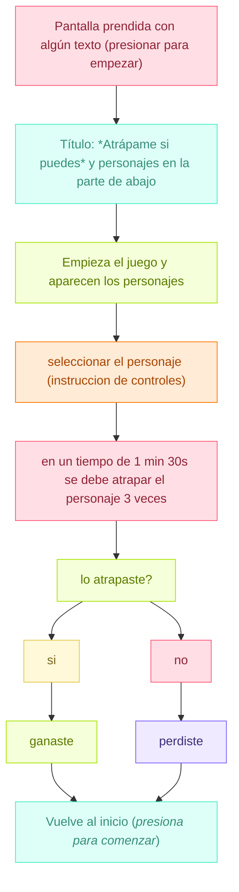

# sesion-15a
18-11-2025
## Apuntes

- Martes 25 día de paseo
  - 09:30 metro salvador
  - 11:00 MAC parque forestal
- Viernes 28 trabajo en clases, última sesión
- El proyecto tiene que ser específico
- Miércoles 26 charla Mateo
  
---

¿Cómo conectar p5.js a Arduino?

- Para conectar p5.js con Arduino, necesitamos una aplicación intermedia como p5.serialcontrol o `Node.js, que actúe como servidor serial y luego usar la biblioteca p5.serialport en tu código p5.js.
- Si queremos conectar el controlador de p5.js directamente con arduino para luego interactuar con p5.js nuevamente, necesitaremos una placa usb host y una biblioteca llamada `USB Host Library 2.0`

Entrada serial a p5.js usando la biblioteca p5.serialport:

[Entrada Serial a P5.js](https://itp.nyu.edu/physcomp/labs/labs-serial-communication/lab-serial-input-to-the-p5-js-ide/#:~:text=El%20boceto%20p5.,js&text=Al%20ejecutar%20este%20sketch%20p5,escuchar%20algunos%20datos%20seriales%20entrantes.)

## Nuevo proyecto 
Como grupo tuvimos un debate sobre el proyecto y como nos sentiamos al respecto. La conclusión fue que ninguna estaba satisfecha al 100% con el proyecto que estabamos planteando, por lo que decidimos darle una vuelta y llegamos a una nueva idea de proyecto que nos emocionara y motivara a todas.

MÁQUINA SENTIMENTAL "ATRÁPAME SI PUEDES"

`SENTIMIENTOS:`
- frustración
- dominar (tener el control)
- dirigir
- competitividad


### Presentación textual 
es una máquina interactiva que funciona con sensores de fuerza, presentado como botones. El usuario escoge su personaje antes de empezar la partida (para el examen). El objetivo del juego es alcanzar (atrapar) este personaje, usando los controles.

Pero el juego está diseñado para que el personaje se escape justo cuando estás a punto de atraparlo. Esto mezclado con la dificultad de usar el control, el cual será no será ergonómico (estará al revés), provoca una mezcla de frustración y risa, porque el error estará en la complejidad y comodidad del usuario.

La interacción crea una especie de competencia emocional entre el usuario y la máquina.

`METÁFORA:`
- La máquina es una representación tecnológica del logro frustrado: esa sensación cotidiana en la que la promesa del éxito se rompe por un detalle mínimo. Al mismo tiempo, habla de la experiencia humana de perseguir algo que siempre se escapa: expectativas, logros, reconocimiento o metas personales y emocionales que parecen estar al alcance… pero nunca del todo. En ese juego constante entre deseo y evasión, la máquina encarna la relación desigual entre la intención humana y la respuesta arbitraria de un sistema. Una máquina que te hace sentir el delicado filo entre querer algo… y perderlo por un gesto mínimo.

### Que utiliza:
Sensor de fuerza


El sensor es diseñado para detectar y medir la fuerza aplicada a un objeto, convirtiendo esa fuerza en una señal eléctrica que un sistema puede interpretar, lo que causa un cambio en su resistencia eléctrica y genera una señal proporcional a la fuerza aplicada.

¿Cómo funciona el sensor?

1. Aplicación de Fuerza: Pones peso o empujas el cuerpo metálico.
2. Deformación: El cuerpo metálico se dobla o estira ligeramente. Las galgas pegadas a él se deforman en la misma medida.
3. Cambio Eléctrico: Cuando una galga se estira, su resistencia eléctrica aumenta. Cuando se comprime, su resistencia disminuye.
4. Circuito (Puente de Wheatstone): Estas galgas están conectadas en un circuito especial (Puente de Wheatstone) que convierte esos cambios de resistencia en un pequeño voltaje de salida.
5.Resultado: Cuanto mayor es la fuerza, mayor es el cambio de resistencia, y por lo tanto, mayor es el voltaje de salida.
 
En resumen, el sensor de fuerza utiliza la relación lineal entre la fuerza aplicada, la deformación del material (principio de Hooke), y el cambio de resistencia eléctrica (principio de la galga) para ofrecer una medición precisa de la carga.

¿Cómo se conecta al Arduino?

- FSR extremo 1 -> 5V
- FSR extremo 2 -> A0
- Resistencia 10kΩ extremo 1 -> A0
- Resistencia 10kΩ extremo 2 -> GND

`BILL OF MATERIAL`

| Marca    | Nombre en página web                          | Materiales        | Cantidad | Precio   | Descripción                                                                                                                                                                                                                                                                                                                                                                                                                                                                                                                                                  | Links |
|----------|------------------------------------------------|-------------------|----------|----------|--------------------------------------------------------------------------------------------------------------------------------------------------------------------------------------------------------------------------------------------------------------------------------------------------------------------------------------------------------------------------------------------------------------------------------------------------------------------------------------------------------------------------------------------------------------|--------|
| Afel     | Sensor de Fuerza / Presión FSR402              | Sensor de fuerza  | 2        | $7.500   | - Rendimento: Circuito Infinito / abierto (sin presión, 100kΩ ligera presión) a 200Ω (presión máx).  
- Rango de fuerza: 0 a 20 lb (0 a 100 Newtons) que se aplica de manera uniforme sobre el área de superficie de 0,125 pulgadas cuadradas.  
- Fuente de alimentación: Cualquiera este sensor utiliza menos de 1 mA de corriente (depende de las resistencias de pull-up / down utilizadas y voltaje de alimentación). | https://afel.cl/products/sensor-de-fuerza-presion-fsr402?variant=45125253169304&country=CLP&utm_medium=product_sync&utm_source=google&utm_content=sag_organic&utm_campaign=sag_org&utm_term=&utm_campaign=p-+Smart+Shopping&utm_source=adwords&utm_medium=ppc&hsa_acc=1808722794&hsa_cam=18405560573&hsa_grp=&hsa_ad=&hsa_src=&hsa_tgt=&hsa_kw=&hsa_mt=&hsa_net=adwords&hsa_ver=3&gad_source=1&gclid=CjwKCAjzrpCkBhA3EiwAUaBUdV-Mubd3XP5liuktsAks9c00Whain1PvZ6wDWwBeaaBRRY4OkTFboCDnEQAvD_BwE |
| Arduino  | Arduino UNO R4 WiFi                            | Arduino           | 1        | $38.990  | El Arduino UNO R4 WiFi combina la potencia de procesamiento y los nuevos y emocionantes periféricos del microcontrolador RA4M1 de Renesas con la potencia de conectividad inalámbrica del ESP32-S3 de Espressif. Además de esto, el UNO R4 WiFi ofrece una matriz LED 12×8 integrada, conector Qwicc, VRTC y pin OFF, que cubre todas las necesidades potenciales que los creadores tendrán para su próximo proyecto. | https://arduino.cl/producto/arduino-uno-r4-wifi/?srsltid=AfmBOoo62QpUUNDMPTe_9rBbQ5jmJMG6rwsG4MTKelnH8mpRtnHcyVfI |
| Afel     | Kit 600 Resistencias 1/4W - 30 Valores         | Resistencias      | 2        | $4.990   | - Bajo valor (Ω): 10, 22, 47, 100, 150, 200, 220, 270, 330, 470, 510, 680  
- Medio valor (KΩ): 1, 2, 2.2, 3.3, 4.7, 5.1, 6.8, 10, 20, 47, 51, 68  
- Alto valor (KΩ/MΩ): 100K, 220K, 300K, 470K, 680K, 1M | https://afel.cl/products/kit-600-resistencias-1-4w-30-valores |
| Afel     | Pack 20 Cables de Conexión Macho Hembra        | Cables            | 1 pack   | $1.000   | - Longitud: 20 cm  
- Tipo de conector: Jumper plano  
- Calibre del cable: 26 AWG  
- Corriente máxima: 1 A  
- Voltaje máximo: 300 V  
- Aislante: PVC  
- Compatible con protoboard estándar y módulos de desarrollo | https://afel.cl/products/pack-20-cables-de-conexion-macho-hembra |
| **TOTAL** |                                                |                   |          | **$52.480** |                                                                                                                                                                                                                                                                                                                                                                                                                                                                                                                      |        |


`DIAGRAMA DE FLUJO`



### Seudocódigo
```
```
### Comportamiento: qué hace, cómo lo hace y que sentimientos provoca
---
El lunes 17-11-2025 logramos que el punto subiera y bajara con los siguientes códigos 

`IZQUIERDA Y DERECHA`

```cpp
#include <Wire.h>
#include <Adafruit_GFX.h>
#include <Adafruit_SSD1306.h>

#define ANCHO 128
#define ALTO 64

// Crear display OLED
Adafruit_SSD1306 display(ANCHO, ALTO, &Wire, -1);

const int Sensor_Fuerza = A0;  // Pin del sensor de fuerza

void setup() {
    Serial.begin(9600);
    pinMode(Sensor_Fuerza, INPUT);

    // Inicializar pantalla OLED
    if (!display.begin(SSD1306_SWITCHCAPVCC, 0x3C)) {
        Serial.println("ERROR: Pantalla OLED no encontrada");
        while (true);  
    }

    display.clearDisplay();
    display.setTextSize(1);
    display.setTextColor(SSD1306_WHITE);
    display.setCursor(10, 10);
    display.println("FSR + OLED OK");
    display.display();
    delay(1000);
}

void loop() {
    int valorFuerza = analogRead(Sensor_Fuerza);

    Serial.print("Sensor de Fuerza: ");
    Serial.println(valorFuerza);

    // Convertir presión en posición HORIZONTAL
    // 0 -> izquierda (x=5)
    // 1023 -> derecha (x=120)
    int posicionX = map(valorFuerza, 0, 1023, 5, 120);

    // Limitar movimientos
    if (posicionX < 0) posicionX = 0;
    if (posicionX > 127) posicionX = 127;

    // Dibujar puntito
    display.clearDisplay();
    display.fillCircle(posicionX, 32, 3, SSD1306_WHITE);  // y=32 (centro vertical)
    display.display();

    delay(50);
}

```

`DERECHA`

```cpp
#include <Wire.h>
#include <Adafruit_GFX.h>
#include <Adafruit_SSD1306.h>

#define ANCHO 128
#define ALTO 64

// Crear display OLED
Adafruit_SSD1306 display(ANCHO, ALTO, &Wire, -1);

const int Sensor_Fuerza = A0;  // Pin del sensor de fuerza

void setup() {
    Serial.begin(9600);
    pinMode(Sensor_Fuerza, INPUT);

    // Inicializar pantalla OLED
    if (!display.begin(SSD1306_SWITCHCAPVCC, 0x3C)) {
        Serial.println("ERROR: Pantalla OLED no encontrada");
        while (true);  
    }

 display.clearDisplay();
    display.setTextSize(1);
    display.setTextColor(SSD1306_WHITE);
    display.setCursor(10, 10);
    display.println("FSR + OLED OK");
    display.display();
    delay(1000);
}

void loop() {
    int valorFuerza = analogRead(Sensor_Fuerza);

    Serial.print("Sensor de Fuerza: ");
    Serial.println(valorFuerza);

    // Convertir presión en posición vertical
    // 0 -> abajo (y=60)
    // 1023 -> arriba (y=5)
    int posicionY = map(valorFuerza, 0, 1023, 60, 5);

    // Limitar movimientos
    if (posicionY < 0) posicionY = 0;
    if (posicionY > 63) posicionY = 63;

    // Dibujar puntito
    display.clearDisplay();
    display.fillCircle(64, posicionY, 3, SSD1306_WHITE);
    display.display();

    delay(50);
}
```
