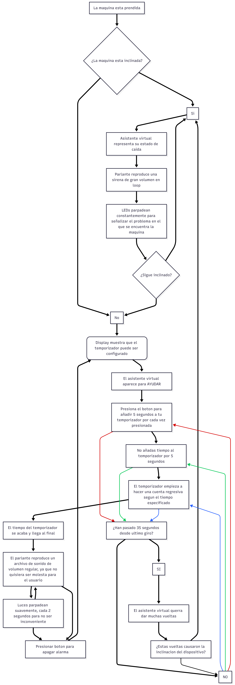
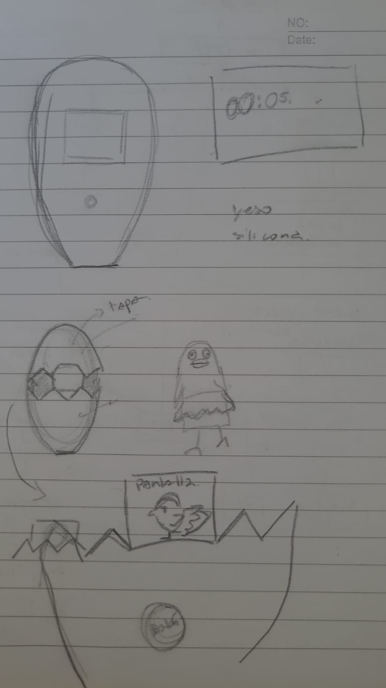
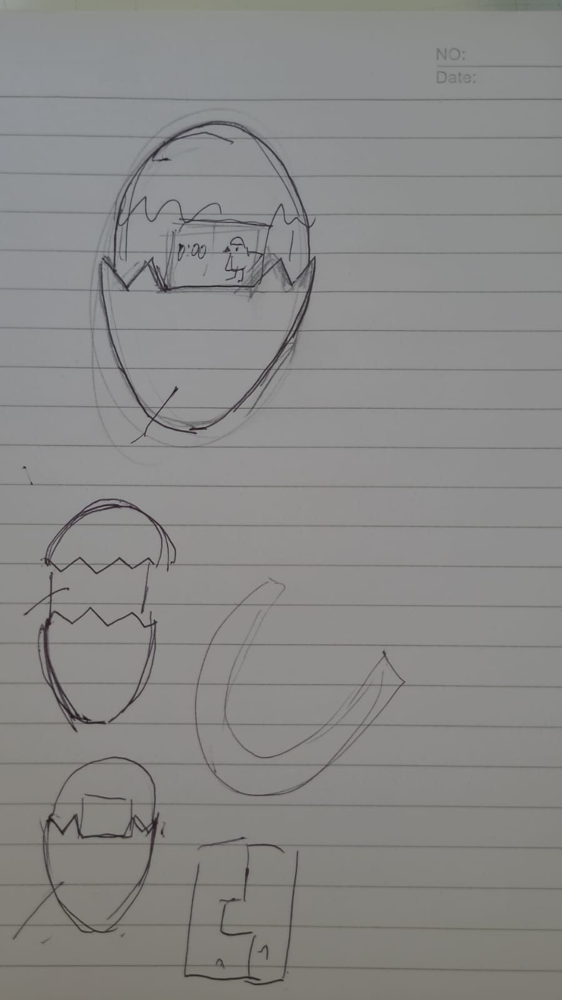

# sesion-14a

## Trabajo en clases

se hace un diagrama de flujo  
Con Seba lo discutimos desde donde parte, hasta todo el recorrido, que deben ser las decisiones , dibuje un diagrama de flujo imagen ( se puede ver en la carpeta imagenes "diagramadeflujo 3") .
 Despues Se edito , y cada uno  del grupo la reviso la estar de acuerdo , quedo asi. 
 
 
 
### Componentes  
se va a buscar los componentes al lab para ver si hay. Y nos fue bien por que con la reutilización de componentes del proyecto 2 y el lab reunimos casi todo solo tenemos que comprar botones , motor , pantalla
#### Bocetos
bocetos de como podría ser el proyecto mas especifico la carcasa , como se va a caer mucho y tiene una forma ovalada para facilitar que se caiga seguí pensando en la forma de un huevo. tengo la idea de que el interior de imprecion 3D que sostiene todos los componentes ( como un esqueleto sostiene los organos ) y cuenta con una cascara exterior que asemeja la apeciencia de un huevo quebrado , dejando que la pantalla se vea en el medio .

#### Carcasa 
hablamos de que material puede ser la carcasa que materiales conocemos ( yeso, silicona, resina, imprecion 3D) y que nos parasen se escoge que sea silicona ya que es flexible y amortigüara las caídas del proyecto va a tener. 
yo he trabajado con alginato y yeso siendo el alginato para sacar el negativo y con el yeso el positivo , pero me llama la anteción de la silicona encontra este ejemplo de una impresion de un brazo.

https://www.smooth-on.com/tutorials/alja-safe-alginate-cast-silicone-body-parts/ 

##### Carta grant 
terminamos de hacer la carta grant , se decide como grupo y se revisa 
## Resumen 
Temporizador inconveniente : por su forma causa su caída , la cual la mascota virtual no aprecia cuando esta inclinado suena una alarma sonora y visual  avisando al usuario para ponerlo de nuevo derecho .
