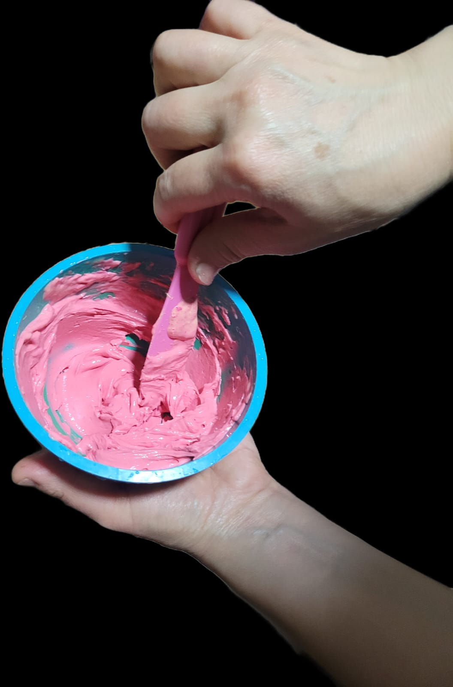
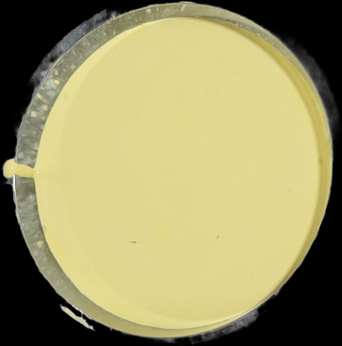
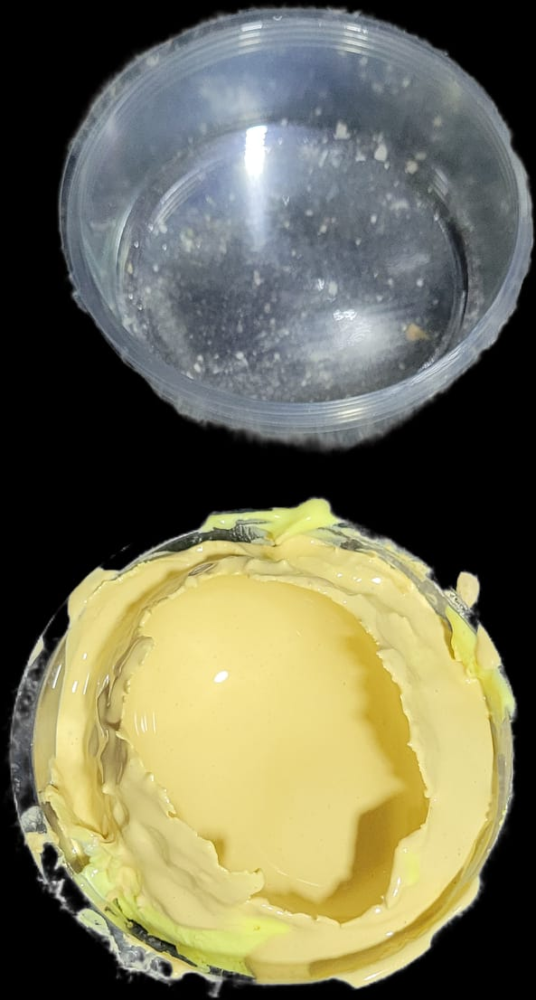
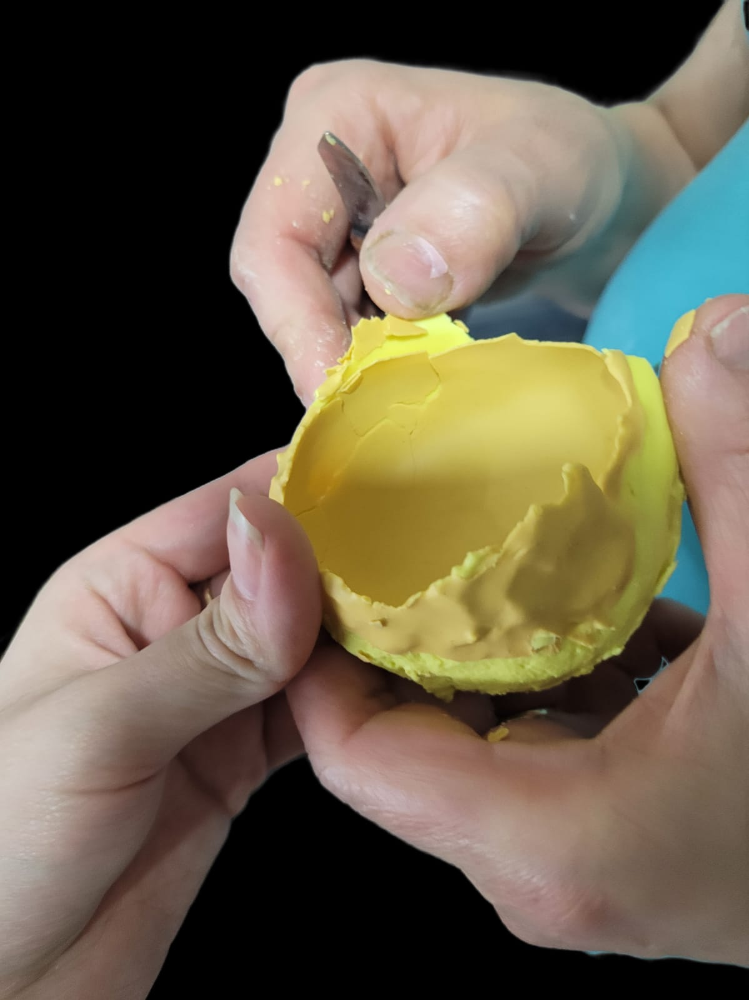
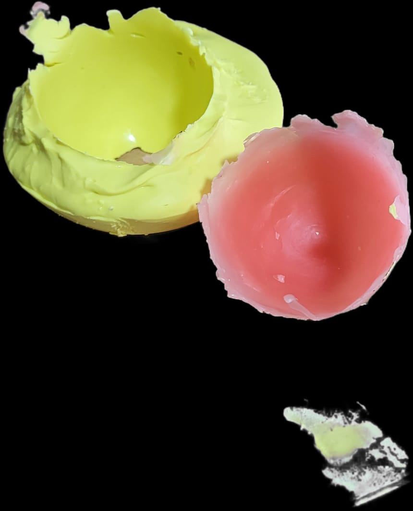
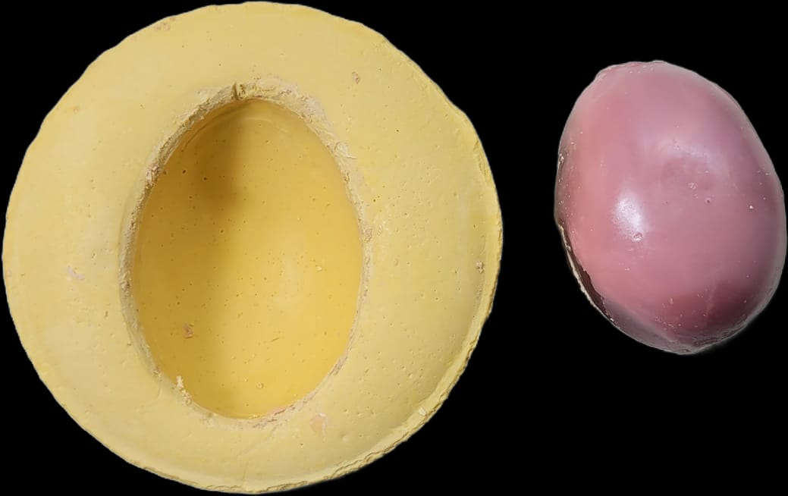

# sesion-14b
 ## Experimentación de cascara

### Materiales  
⦁	alginato 
⦁	yeso 
⦁	cera

Se estuvo prototipando con estos materiales 
####  ◇ 0
Para entender el alginato viene en formato de polvo que se mescla con agua y con la temperatura se activa por lo que hay que agitarlo se ve con un cambio de color que presenta primero rosado que cambia a amarillo .
 
  

####  ◇ 1
En el experimento 1 se ocupa alginato y yeso : si bien es el procedimiento estándar hay que tener en cuenta el desafío que presenta la forma de huevo , se hizo una impresión de la mitad horizontal  "huevo"  y se  aplico el yeso , tratando de generar una película en toda la forma , parecido a como se hacen los huevitos de chocolate
 

despes se desprende con cuidado, quedo muy fina la capa de yeso , se rompe 

  
####  ◇ 2
En esta probeta  se  saca la impresión de la mitad del huevo pero esta ves en formato vertical , además se aplico cera para hacer la carcasa es decir despues de sacar el huevo se aplico cera de a poco formando una pelicula 
 
 
  
####  ◇ 3
 En este prototipo  se ocupo yeso para y cera , en un pote se puso el yeso y para que no quedara pegada la piedra de huevo se le puso una capa de cera, se caso la impresion en formato horizontal
  
 ##### 3.1
 en uno se hizo en un pote poco profundo y la piedra salió mas fácil , después se hizo un película de cera
  
##### 3.2
se hizo en un pote mas profundo, costo que saliera la piedra ( se sumerje en agua calinta para que la cera se derita y pueda salir la piedra ). quedo un molde de buena calidad de yeso para futuras probetas
 
 
