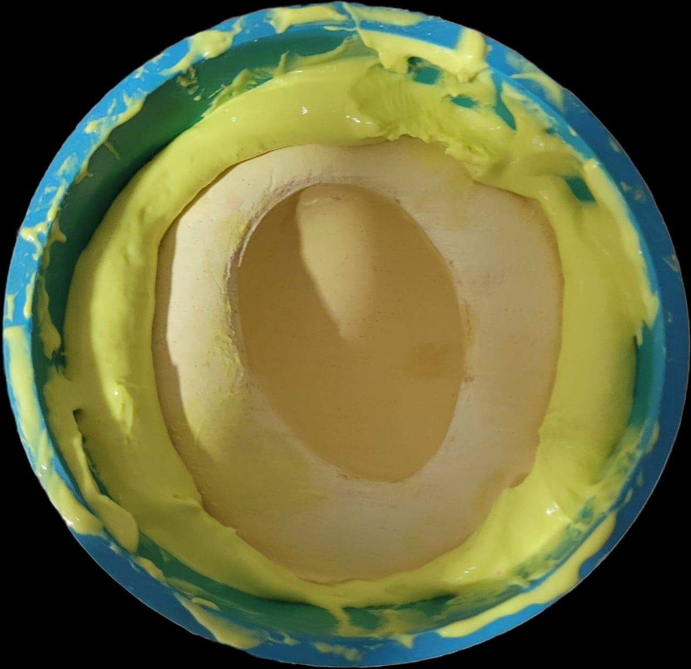
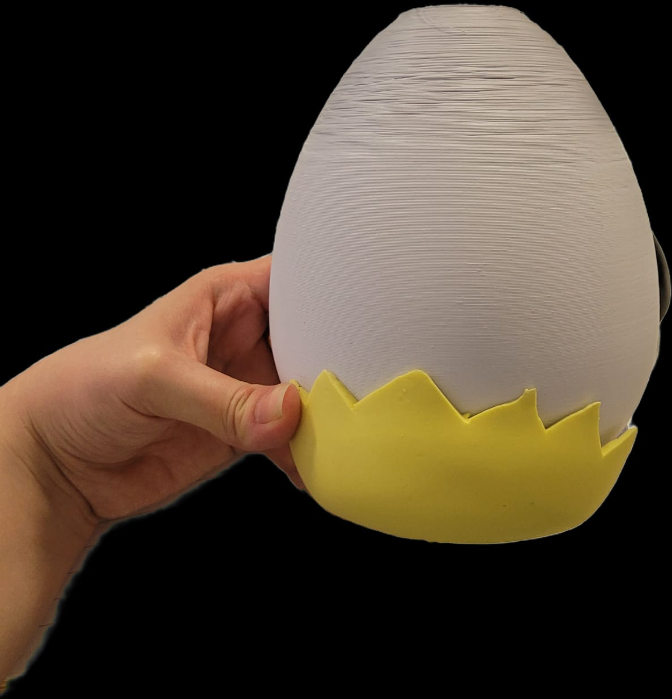

# sesion-15a
## trabajo en clase 

traje prototipos de alginato para la cascara exterior 

Angie → termino las imágenes para la pantalla de la mascota virtual 

Seba → viendo temporizador - mili 

Moss → confugurar la pantalla 

Cami → modelado de molde 

Bernardita → modelado de componentes

⦁	Seba hizo funcionar la pantalla , se percato que tenia soldado dos pines juntos , al separarlos si funciono  

Con Angie y Seba estuvimos viendo el parlante , como estábamos ocupando lo mismo que teníamos del proyecto 2 , no esperábamos que no funcionara , se reviso el cableado  varias veces. El seba investigo , estuvo probando con códigos de ejemplos pero nada , igual le pasaba a otro equipo 

