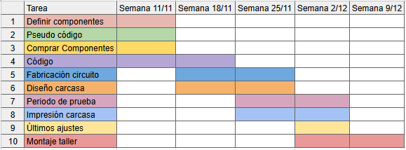
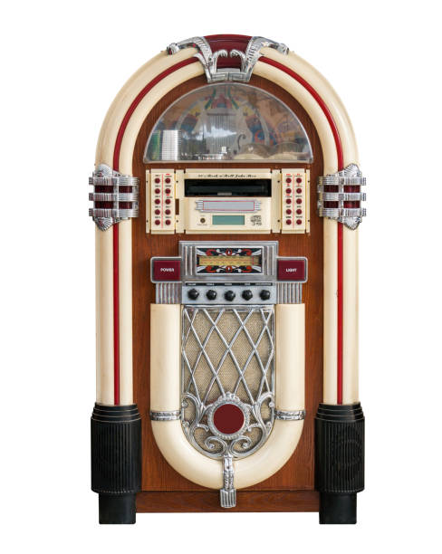

# sesion-14a

martes 11 de noviembre

La Cami trajo un humificador viejo que tenía y lo desarmamos para ver sus componentes. También compramos el módulo del humificador de [esta página.](https://www.tienda8.cl/mas-productos/humidificador-aire-domestico-generador-de-niebla-usb-5v-diy)

Además hicimos la carta gantt:





## Investigación

Esta clase me dediqué a investigar sobre el encoder que usaremos para la manivela

El primer código que encontré en [MCI electronics](https://cursos.mcielectronics.cl/2023/02/23/como-funciona-el-encoder-rotatorio-y-la-interfaz-con-arduino/) era para ver cuántos pasos da, pero nosotros necesitamos saber cuántas vueltas da y llevar la cuenta.

[código encoder de MCI electronics](./encoderMCIelectronics/encoderMCIelectronics.ino)

Vi que cada 20 pasos es una vuelta.
Podemos hacer una función que con cada 20 pasos cuente una vuelta.

La idea es hacer un if que diga que si el paso es múltiplo de 20, sume una vuelta a una variable "vueltas".

```cpp
if (step % 20 == 0) {
  vueltas++;
}
```

[Código contador de vueltas](./contadorVueltas/contadorVueltas.ino)

Está bien, pero me equivoqué, no era que sea múltiplo de 20, tiene que ser cada 20 pasos, es decir, cuando step sea 20, 40, 60, etc.

```cpp      
if (step == vueltas * 20) {
  vueltas++;
}
```

Actualicé el código para que nos muestre las vueltas en el monitor serial.