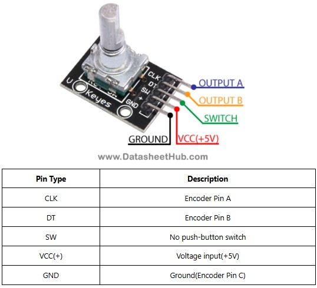

# sesion-14b

viernes 14 de noviembre

Hoy llegué súper tarde a la clase porque me quedé dormido.

Ayer estuve en Valparaíso todo el día porque mi polola necesitaba ayuda en un desfile de moda, fui como su fotógrafo y apoyo.

Llegamos súper tarde y me costó un mundo despertar.

---

Como la clase pasada logré contar las vueltas del encoder, hoy voy a empezar a hacer la clase "Manivela" para poder encapsular lo que quiero hacer con el encoder.

Estoy usando estas clases de referencia:

- [sesión-05a](https://github.com/felix-rg416/dis8645-2025-02-procesos/tree/main/25-felix-rg416/sesion-05a)
- [Codigo Sesion-09b](https://github.com/felix-rg416/dis8645-2025-02-procesos/blob/main/25-felix-rg416/sesion-09b/grupo-06-montoyamoraga)

## Pines del encoder



El encoder tiene 3 pines:

- CLK (Clock) sirve para detectar los cambios de estado.
- DT (Data) sirve para detectar la dirección del giro.
- SW (Switch) sirve para detectar si se presiona el botón del encoder.

## Pseudo código

Existe un calculoVueltas(funcion que calcula las vueltas del encoder);

A partir del `calculoVueltas` se entrega `vueltas`

Existen rangos de vueltas:

- **Rango 0** = 0 a 1 vueltas (2)
- **Rango 1** = 2 a 8 vueltas (7)
- **Rango 2** = 9 a 16 vueltas (9)
- **Rango 3** = 17 a 24 vueltas (8)
- **Rango 4** = 25 a 29 vueltas (6)
- **Rango 5** = más de 30 vueltas

Si pasa de las 30 vueltas, se reinicia el conteo.

Si se retrocede en las vueltas, retroceden los rangos.

---

## Rangos

Los rangos de vueltas sirven para activar ciertos componentes paso a paso.

Cada rando debe tener su nmbre para poder llamarnlo en otras funciones.

- En el Rango 0: led 0
- En el Rango 1: led 1 + sonido 1
- En el Rango 2: led 2 + sonido 2 + vibración
- En el Rango 3: led 3 + sonido 3 + compuerta 
- En el Rango 4: muchos leds + sonido de victoria + vibración + humificador
- En el Rango 5: Vuelve al inicio.

El código de los rangos lo haré en la función `rangos()` y cada rango tedrá su nombre `rango0`, `rango1`...

La idea es decir "si vueltas están entre 0 y 1, activar rango0", "si vueltas están entre 2 y 8, activar rango1", etc.

Para luego poder decir "si estoy en rango1, activar led1 y sonido1", etc.

Cuando pase de 30 vueltas, el conteo de vueltas vuelve a 0.

## Codigo

- `void configurar()`

    - `int patitaCLK`
    - `int patitaDT`
    - `int patitaSW`

- `void calculoVueltas()` incluirá la función que calcula las vueltas del encoder.
- `void rangos()` incluirá la función que define los rangos según las vueltas.

El código de los rangos sería algo así:

```cpp
void rangos() {
    if (vueltas >= 0 && vueltas <= 1) {
        rango0();
    } else if (vueltas >= 2 && vueltas <= 8) {
        rango1();
    } else if (vueltas >= 9 && vueltas <= 16) {
        rango2();
    } else if (vueltas >= 17 && vueltas <= 24) {
        rango3();
    } else if (vueltas >= 25 && vueltas <= 29) {
        rango4();
    } else if (vueltas >= 30) {
        rango5();
    }
}
```

---

Me ayudó mucho la función de Copilot de VSCode que me sugirió y mostró cómo hacer partes del código.

Me ha costado entender cómo hacer las clases.

Lo puse en Arduino IDE y no me funciona, me tira varios errores.

El martes le preguntaré a Aarón para que me ayude a solucionar mis dudas.

