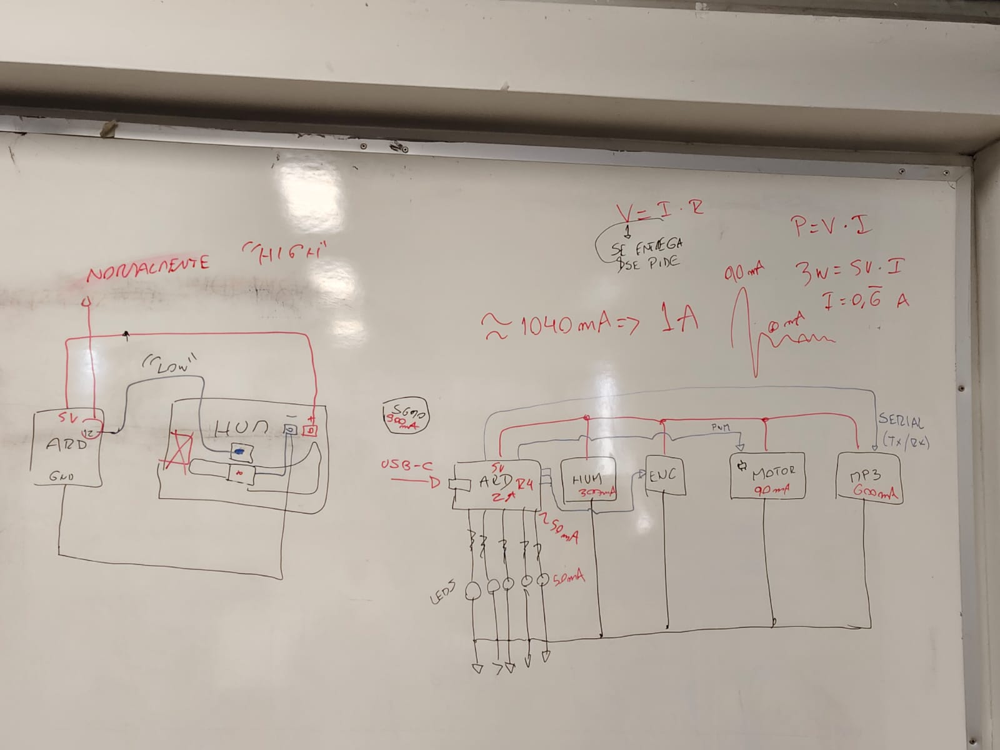

# sesion-15a

martes 18 de noviembre

Aarón me ayudó con el código.

Lo actualizamos y ahora es el [manivelaFinal](./manivelaFinal/)

Habían hartos errores en el código original.

Cambiamos la forma de hacer lo de los rangos, en vez de poner nombre a cada uno, hicimos que con el `int rango;` se vaya definiendo los rangos con un if,
así:

```cpp
  if (Manivela::vueltas >= 0 && Manivela::vueltas <= 1) {
    Manivela::rango = 0;
```

Todo esto dentro del void `void Manivela::calcularRango() {`

También me faltó poner `Manivela::` en varias partes del código, pero ya se resolvió.

Los `String` son complejos, por lo tanto, Aarón me recomendó usar `bool` para "direccionActual"

---

Por otro lado, Misa nos mostró que nuestros componentes consumen casi el máximo ed miliamperios que puede entregar el Arduino Uno R4 Minima conectado a USB C.

Nos recomendó usar si o sí el USBC como funete de poder.



---

Hoy me toca empezar con el modelado 3D del proyecto.

Lo haré en Inventor.