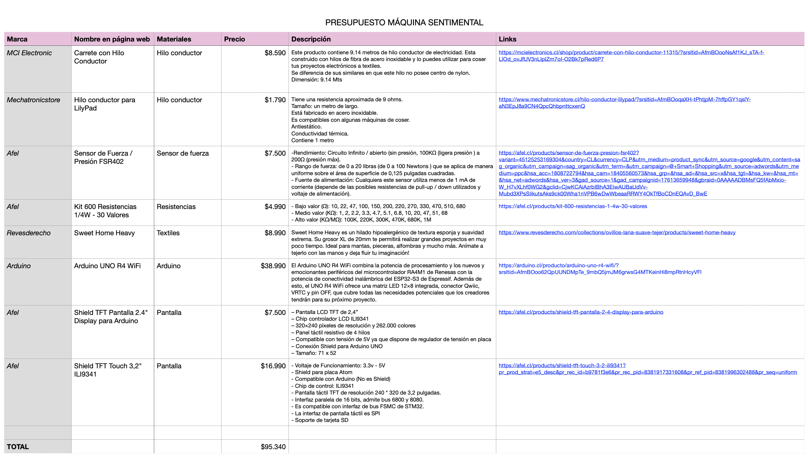

# sesion-13b

07-11-2025

## Apuntes

- Los profes dijeron que hay que darle misiones al usuario, como por ejemplo que tomen un led y lo conecten en alguna parte. O que el mismo usuario explote un condensador
- `Encoder:` Es un dispositivo que convierte el movimiento, ya sea rotatorio o lineal, en señales eléctricas que un sistema de control puede leer. Una manibela que gira sin límite y solo te indica hacia que lado giraste la perilla.
- Después de cada revisión Aarón dijo que 
  - No debemos humanizar a la máquina (no atribuirles onjetos humanos)
- Nos revisaron la descripción del proyecto que teníamos.
  - Nos dijeron que debemos explorar materiales, explorar sensores, no esforzar las emociones, abrir la mente (no solo decir miau)
  - Nos debemos enfrentar a defender la complejidad del proyecto

---

Discurso (modificar)

El proyecto propone la creación de una máquina sentimental, un artefacto interactivo capaz de reaccionar sensiblemente al entorno especialmente al ruido, la voz o el tacto y de expresar esas emociones a través de visuales luminosos y patrones en movimiento.

La máquina funciona como una especie de organismo emocional. Su cuerpo, hecho con materiales suaves y cálidos como lana, fieltro o telas táctiles, invita al contacto humano y sugiere vulnerabilidad o afecto. En su interior, un Arduino junto con sensores de sonido y tacto (micrófono, sensor piezoeléctrico o capacitivo) registran los estímulos externos. Estos datos son traducidos en tiempo real a respuestas visuales por ejemplo, luces que cambian de color, intensidad o ritmo, representando lo que ocurre en su interior emocional.

La máquina no busca ser útil, sino sensible. Exagera la relación entre el cuerpo y la emoción, entre la materia y la respuesta, funcionando como un espejo de nuestra propia necesidad de conexión. Puede reaccionar de manera impredecible: a veces se ilumina suavemente ante una caricia, otras se sobresalta con un ruido brusco.

El objetivo del proyecto es explorar la idea de afectividad en los objetos tecnológicos y cuestionar los límites entre lo vivo y lo mecánico. ¿Puede una máquina sentir? ¿O simplemente imitar nuestras formas de sentir? A través de su diseño táctil y sus respuestas lumínicas, la máquina sentimental busca generar una experiencia empática y poética entre el espectador y el objeto, donde la interacción se vuelve una forma de comunicación emocional.
Funcionamiento


El proyecto propone la creación de una máquina sentimental, un artefacto interactivo capaz de reaccionar sensiblemente al entorno especialmente al ruido, la voz o el tacto  y de expresar esas emociones a través de visuales luminosos y patrones en movimiento.


---

`Próximo martes tener: presupuesto, carta gantt macro (semana a semana), bocetos físicos y diagramas de flujo, pseudocódigo`




---

### Segundo bloque, clase por Mateo y Janis

- Como tarea en clases nos dijeron que tenemos que ver el presupuesto, los precios y colocar los links en un excel.

<https://docs.google.com/spreadsheets/d/1nhrQ1oRp-5UN_uKfqg0K773DzKn21EXrJUpgr3MPjUU/edit?gid=1368405296#gid=1368405296>

- sensores de tacto
- touchdesigner para las visuales y hacerlas en una página web con p5.
- se visualizará en una pantalla y a esto hacerlo una carcasa.
- plantear bien la idea material

`arduino uno r4 wifi, investigar servidor y cliente, conexiones inalambricas`

Janis nos dijo que trabajaramos con arduino r4 wifi, ella nos ayudaría y Mateo nos ayudaría a realizar los mapping en una página web desde github.

---

ARDUINO UNO R4 WIFI

¿Qué hardware tiene el UNO R4 WiFi?

- El UNO R4 WiFi combina un microcontrolador principal Renesas RA4M1 (ARM Cortex-M4) y un módulo ESP32-S3 que se encarga de Wi-Fi y Bluetooth. Esto significa que la conectividad inalámbrica se gestiona por el coprocesador ESP32-S3 integrado

Librerías y ejemplos oficiales

- Arduino distribuye ejemplos y una librería WiFi específica para el UNO R4 (incluida en el paquete de la placa en el IDE). En la documentación oficial hay ejemplos de WebClient, WebServer (AP_SimpleWebServer) y otros. Empieza por instalar el paquete UNO R4 WiFi en el Boards Manager y revisar “WiFi examples” en la doc

Modos de operación Wi-Fi (conceptos)

- Modo cliente (Station, STA): el UNO R4 se conecta a un router/SSID como cualquier dispositivo; con WiFi.begin(ssid, pass) obtienes IP y puedes abrir sockets/TCP/HTTP hacia servidores externos.
- Modo punto de acceso (AP / SoftAP): el UNO R4 puede crear su propia red Wi-Fi (SSID propio) y atender clientes locales; útil para páginas web locales o control sin router.
- Servidor vs cliente (aplicación):
  - Servidor = tu UNO R4 escucha conexiones entrantes (p. ej. web server HTTP, socket TCP server).
  - Cliente = tu UNO R4 abre conexiones a servidores externos (p. ej. hacer GET a una API, enviar datos a un servidor TCP).

Ejemplo mínimo: Cliente HTTP (conseguir un recurso web)
```cpp
#include <WiFi.h>        // librería incluida en el core UNO R4 WiFi
#include <WiFiClient.h>

const char* ssid = "TU_SSID";
const char* password = "TU_PASSWORD";

void setup() {
  Serial.begin(115200);
  delay(1000);
  WiFi.begin(ssid, password);
  Serial.print("Conectando a WiFi");
  while (WiFi.status() != WL_CONNECTED) {
    delay(500);
    Serial.print(".");
  }
  Serial.println();
  Serial.print("IP: ");
  Serial.println(WiFi.localIP());

  // conexión HTTP simple
  WiFiClient client;
  if (client.connect("example.com", 80)) {
    client.println("GET / HTTP/1.1");
    client.println("Host: example.com");
    client.println("Connection: close");
    client.println();
    while (client.connected() || client.available()) {
      if (client.available()) {
        String line = client.readStringUntil('\n');
        Serial.println(line);
      }
    }
    client.stop();
  } else {
    Serial.println("No se pudo conectar al servidor HTTP");
  }
}

void loop() { }

```

Ejemplo mínimo: Servidor web en modo AP (página simple)

```cpp
#include <WiFi.h>
#include <WebServer.h>   // puede llamarse WebServer o WiFiServer según ejemplo

const char* ap_ssid = "MiUNO_R4_AP";
const char* ap_pass = "12345678";

WebServer server(80);

void handleRoot() {
  server.send(200, "text/html", "<h1>Hola desde UNO R4 WiFi</h1>");
}

void setup() {
  Serial.begin(115200);
  WiFi.softAP(ap_ssid, ap_pass);          // crea AP
  Serial.println("AP creado, IP: ");
  Serial.println(WiFi.softAPIP());
  server.on("/", handleRoot);
  server.begin();
}

void loop() {
  server.handleClient();
}

```

HTTPS / SSL y limitaciones

- El UNO R4 tiene ejemplos para conexiones HTTPS (Web Client SSL). Hacer HTTPS en microcontroladores requiere cuidado con certificados y memoria; revisa el ejemplo oficial “WebClient SSL” para ver cómo gestionarlo.
- Limitación práctica: conectar el UNO R4 como cliente a redes WPA2-Enterprise puede no ser posible con el módulo Wi-Fi del R4 (ESP32-S3) según reportes de usuarios — confirmar si tu red usa ese tipo de autenticación

Problemas y consejos prácticos / troubleshooting

- Si las páginas en modo AP no responden (timeout): revisa que la IP devuelta por el AP sea la que usas en el navegador; algunos usuarios reportan timeouts con el ejemplo AP_SimpleWebServer y han necesitado comprobar versión del core y navegador. Instalar/actualizar el UNO R4 board package suele resolver muchos problemas.
- Asegúrate de tener la versión correcta del core UNO R4 en el IDE (Boards Manager) — las librerías WiFi necesarias vienen con ese paquete.
- Para debugear: Serial prints del estado de conexión (WiFi.status()), WiFi.localIP() / WiFi.softAPIP(), y chequear si el puerto está abierto (telnet/nmap) desde la máquina cliente ayudan mucho

Recursos oficiales y lecturas recomendadas (para profundizar)

- Página oficial UNO R4 WiFi (datos de la placa, resumen): documentación Arduino.
- Tutoriales / ejemplos WiFi para UNO R4 en la documentación de Arduino (WebServer, WebClient, AP).
- Datasheet / manual del UNO R4 WiFi (PDF) — info técnica y características.
- Hilos y foros (problemas reales, WPA2 Enterprise y timeouts AP): Arduino Forum / StackOverflow. Útiles para ver soluciones prácticas y errores reportados por la comunidad.

<https://docs.arduino.cc/hardware/uno-r4-wifi/>

<https://docs.arduino.cc/tutorials/uno-r4-wifi/wifi-examples/>

<https://forum.arduino.cc/t/arduino-uno-r4-wifi-web-client-ssl-example-html-js-syntax-from-web-server/1375227>

<https://forum.arduino.cc/t/using-arduino-r4-wifi-on-a-wpa-2-enterprise-network/1272729>

<https://docs.arduino.cc/tutorials/uno-r4-wifi/r4-wifi-getting-started/>

<https://docs.arduino.cc/resources/datasheets/ABX00087-datasheet.pdf>

<https://forum.arduino.cc/t/unor4-with-wifi-and-the-wifisslclient-library/1184221>

<https://forum.arduino.cc/t/uno-r4-wifi-access-point/1225068>

<https://docs.arduino.cc/tutorials/uno-r4-wifi/cheat-sheet/>

<https://forum.arduino.cc/t/arduino-r4-wifi-vs2022-tcp-client-server/1397088>

<https://forum.arduino.cc/t/arduino-r4-wifi-access-point/1146018>

<https://github.com/tigoe/Wifi_Examples>

---

El proyecto propone la creación de una máquina sentimental, un artefacto interactivo capaz de reaccionar sensiblemente al entorno especialmente al tacto humano esas emociones a través de visuales luminosos y patrones en movimiento.

la máquina reacciona depende la intensidad con que la toque, si es muy bruzco, lo pinchas, lo peñizcas, lo acaricias, lo aplastas, etc. esto reacciona en visuales que dependen de cada acción.

---

`MANIFIESTO`

La máquina sentimental es un organismo artificial que responde al tacto humano como si tuviera emociones propias. Representa el intento de traducir afectos en datos; de convertir gestos en lenguaje digital.

Su cuerpo, hecho de una materialidad blanda y orgánica, invita al acercamiento, pero también despierta la curiosidad por lo desconocido que habita en lo artificial.

Esa mezcla de suavidad y extrañeza genera un momento de duda: el usuario no sabe si enfrentarse a un objeto inerte o a una presencia viva. En ese instante, la tecnología deja de ser solo herramienta y se vuelve territorio sensible, un espacio de descubrimiento donde lo mecánico parece respirar.

La máquina no busca imitar lo humano, sino evocar emociones a través de la interacción.

Cada gesto (apretar, estirar o acariciar) es un lenguaje que el cuerpo humano ofrece y la máquina interpreta, devolviendo una respuesta sonora y visual que traduce ese impulso en un paisaje emocional.

---

Máquina Reactiva: En su estado de reposo, su formas y materialidad atraen. "La curiosidad mato al gato y al usuario a interactuar con la máquina y descubrir su reacción". Al apretar, estirar o acariciar, la máquina despierta y responde proyectando gráficas y sonido en sincronía con cada acción. Cuando se deja la interacción, retorna a su quietud original, como un organismo que exhala y se repliega en sí mismo.

Interacción:


> 1. La máquina permanece en reposo y en silencio.

> 2. Su forma y materialidad generan curiosidad.

> 3. El usuario se aproxima y decide tocarla.

> 4. La interacción se divide en tres acciones posibles: apretar (15 segundos), estirar (15 segundos) o acariciar (15 segundos), cada una activando una respuesta distinta.

> 5. Al iniciar una nueva acción, la anterior se desactiva, manteniendo la interacción autónoma y única por gesto.

> 6. La máquina responde con gráficas y sonido sincronizados según la acción elegida.

> 7. Al dejar de tocarla, la actividad disminuye gradualmente durante 5 segundos.

> 8. La máquina vuelve a su reposo inicial, lista para reiniciar el ciclo.

---

### Tipos de referentes

- Referentes de tejidos
- Referentes de exposiciones
- Referentes de códigos
- Referentes de objetos:
  - Makey Makey
