# sesion-14b

14-11-2025

## Apuntes

- Bash language: sirve para controlar terminales, que corre en la PowerShell.
- MAC Addres: identificador único e inmutable asignado por el fabricante a la interfaz de red de un dispositivo, como una computadora o un teléfono.
- Estuvimos trabajando directamente en el proyecto 03

---

Código para sensor de fuerza: 

```cpp
const int Sensor_Fuerza = A0;  // Pin del sensor de fuerza 

void setup() {
    Serial.begin(9600);
    pinMode(Sensor_Fuerza, INPUT);
}

void loop() {
    int valorFuerza = analogRead(Sensor_Fuerza);  // Leer el valor del sensor
    Serial.print("Sensor de Fuerza: ");
    Serial.println(valorFuerza);
    
    delay(500);  
}
```

```cpp
// Pines del Sensor
const int Sensor_Fuerza = A0;    // Pin analógico para el sensor de fuerza

// Pines del LED RGB (cambia estos pines según tu conexión)
// Usamos pines PWM (~)
const int pinRojo = 9;   // Pin PWM para el color Rojo
const int pinVerde = 10; // Pin PWM para el color Verde
const int pinAzul = 11;  // Pin PWM para el color Azul

// --- DEFINICIÓN DE RANGOS DE FUERZA (¡AJUSTAR ESTOS VALORES!) ---
// Rango Analógico: 0 (sin presión) a 1023 (máxima presión)
const int UMBRAL_0 = 10;   // Sin fuerza / Apagado
const int UMBRAL_1 = 150;  // Muy Baja
const int UMBRAL_2 = 300;  // Baja
const int UMBRAL_3 = 450;  // Media-Baja
const int UMBRAL_4 = 600;  // Media-Alta
const int UMBRAL_5 = 750;  // Alta
const int UMBRAL_6 = 900;  // Muy Alta (Máxima)

void setup() {
    Serial.begin(9600);
    // Configurar pines
    pinMode(Sensor_Fuerza, INPUT);
    pinMode(pinRojo, OUTPUT);
    pinMode(pinVerde, OUTPUT);
    pinMode(pinAzul, OUTPUT);
    
    // Apagar el LED al inicio
    setColor(0, 0, 0); 
}

void loop() {
    int valorFuerza = analogRead(Sensor_Fuerza); // Leer el valor del sensor
    
    // Determinar el rango y establecer el color
    Serial.print("Sensor de Fuerza: ");
    Serial.print(valorFuerza);
    
    if (valorFuerza < UMBRAL_0) {
        // Nivel 0: Sin Presión
        Serial.println(" -> Nivel 0: SIN PRESION (APAGADO)");
        setColor(0, 0, 0); // Apagado
        
    } else if (valorFuerza < UMBRAL_1) {
        // Nivel 1: Muy Baja (Azul)
        Serial.println(" -> Nivel 1: MUY BAJA (Azul/Cian)");
        setColor(0, 50, 255); 
        
    } else if (valorFuerza < UMBRAL_2) {
        // Nivel 2: Baja (Cian)
        Serial.println(" -> Nivel 2: BAJA (Cian)");
        setColor(0, 150, 255); 
        
    } else if (valorFuerza < UMBRAL_3) {
        // Nivel 3: Media-Baja (Verde)
        Serial.println(" -> Nivel 3: MEDIA-BAJA (Verde)");
        setColor(0, 255, 0); 
        
    } else if (valorFuerza < UMBRAL_4) {
        // Nivel 4: Media-Alta (Amarillo)
        Serial.println(" -> Nivel 4: MEDIA-ALTA (Amarillo)");
        setColor(255, 255, 0); 
        
    } else if (valorFuerza < UMBRAL_5) {
        // Nivel 5: Alta (Naranja)
        Serial.println(" -> Nivel 5: ALTA (Naranja)");
        setColor(255, 100, 0); 
        
    } else if (valorFuerza < UMBRAL_6) {
        // Nivel 6: Muy Alta (Rojo Brillante)
        Serial.println(" -> Nivel 6: MUY ALTA (Rojo Brillante)");
        setColor(255, 0, 0);
        
    } else {
        // Nivel 7: Máxima (Rojo Fuerte)
        Serial.println(" -> Nivel 7: MAXIMA (Rojo Fuerte)");
        setColor(255, 0, 0); // O podrías usar otro color como el Magenta: setColor(255, 0, 255);
    }
    
    delay(500);  
}

// Función para establecer el color (Ánodo Común)
void setColor(int r, int g, int b) {
    // Si es Ánodo Común: 255 - valor (0 es MAX brillo, 255 es MIN brillo)
    // Si usas Cátodo Común: analogWrite(pin, valor);
    analogWrite(pinRojo, 255 - r);
    analogWrite(pinVerde, 255 - g);
    analogWrite(pinAzul, 255 - b);
}
```

---

## Avance proyecto 03

### Presentación Textual

"ECOS DE GESTOS"

El proyecto consiste en un objeto inerte que responde al contacto directo mediante las manos, dependiendo de la intensidad de fuerza, la acción con la cual se manipule el objeto, como respuesta de este tacto, en la pantalla que esta en frente de la persona, la grafica que se proyecta (describir la grafica) cambia justo con sonidos (describir sonidos), los cuales en conjunto generan un momento en el cual el usuario queda inmerso en el proyecto por un momento (definir cuanto tiempo).

`MANIFIESTO`

La máquina sentimental es un organismo artificial que responde al tacto humano como si tuviera emociones propias. Representa el intento de traducir afectos en datos; de convertir gestos en lenguaje digital.

Su cuerpo, hecho de una materialidad blanda y orgánica, invita al acercamiento, pero también despierta la curiosidad por lo desconocido que habita en lo artificial.

Esa mezcla de suavidad y extrañeza genera un momento de duda: el usuario no sabe si enfrentarse a un objeto inerte o a una presencia viva. En ese instante, la tecnología deja de ser solo herramienta y se vuelve territorio sensible, un espacio de descubrimiento donde lo mecánico parece respirar.

La máquina no busca imitar lo humano, sino evocar emociones a través de la interacción.

Cada gesto (presionar) es un lenguaje que el cuerpo humano ofrece y la máquina interpreta, devolviendo una respuesta sonora y visual que traduce ese impulso en un paisaje emocional.

```
// REVISIÓN QUE NOS HICIERON EN CLASES

decisiones para no marearse con las posibilidades 
FALTA CONTEXTO, EJEMPLO: CUANDO QUIERO DEPRIMIRME
SUPER ESPECÍFICO
MUY EXPLÍCITO
QUE ES EL TRIUNFO DE ESTE PROYECTO
DEFINIR BIEN
INFINITO A UN ESPECTRO ACOTADO
EJ: QUE ES LA CALMA
ESPECULAR, MÁQUINA IMAGINATIVA
```

DEFINIR 4 PARÁMETROS
- presionar suave
- presionar intermedio
- presionar medio tirao pa fuerte
- presionar muy fuerte

DEFINIR 4 COLORES PARA GRÁFICAS (UNA GRÁFICA REACTIVA A LOS 4 PARÁMETROS)
- MAGENTA
- TURQUESA
- VERDE FLUOR
- AZUL FLUOR

DEFINIR LA EMOCIÓN/LA METÁFORA
- CURIOSIDAD
- CALMA = DESESTRÉS

---

### PLanificación

"CARTA GANTT"

"DIAGRAMA DE FLUJO"

"PRESUPUESTO"

"BOCETOS FÍSICOS"

---

- Partimos con la idea de tomar una acción que normalmente se realiza de manera delicada y precisa, y ejecutarla de forma brusca o exageradamente rápida. La propuesta es elegir tareas cotidianas que suelen requerir cuidado, paciencia o detalle, y realizarlas de una manera totalmente opuesta: absurda, brusca o ridículamente distinta. Como si alguien intentara tejer a toda velocidad o lavarse los dientes con un objeto completamente inadecuado.

`Idea 1: Máquina ...`

Una máquina que reacciona al contacto cuando la tocas suavemente, se altera o colapsa, pero si la presionas con fuerza, se calma.

`Idea 2: Radio fantasma`

Una radio que no sintoniza estaciones reales, sino que genera un collage emocional de sonidos del entorno. Reproduce sonidos distorsionados o samples según el tono predominante. LEDs muestran visualmente las “emociones” del entorno. una radio que no comunica información, sino estados de ánimo.

`Idea 3: Máquina de resonancia sentimental`

Usa un sensor biométrico (pulso o temperatura de la piel) para generar sonido y visuales reactivos.
- Si el usuario está calmado, emite un sonido suave.
- Si está nervioso, la frecuencia sube y los LEDs titilan.

`Idea 4: Caja de memoria sonora`

Un dispositivo que graba pequeños fragmentos de sonido cada vez que alguien se acerca (sensor de proximidad). Luego los reproduce al azar con distorsiones suaves. Cuando alguien toca o se acerca a la caja, emite esta "melodia" creada de fragmentos de grabaciones. memoria afectiva.

`Idea 5: Máquina que llora`

Un artefacto que “llora” agua (con una pequeña bomba) cuando detecta ciertos sonidos, como gritos o altos volúmenes. convierte el ruido del mundo en lágrimas.

### Ideas para proyecto

Una maquina que reacciona cuando le aplicas una fuerza ¿cuál es la reacción? ¿qué hace cuando le aplicas mucha fuerza? ¿qué hace cuando le aplicas una menor fuerza?

- Punching bag, le pegas y se calma.
- Sensores de fuerza.
- Fluido no newtoniano.
- Reacción de fluidos con la presión.
- Cómo medir el impacto/velocidad de la fuerza.
- Sensores FSR de presión. Resistencia que cambia de valor cuando se le aplica la fuerza. Sensor muy sensible, ya que es poco preciso.
- Ver temas contingentes. que para acceder a este vivienda tengas que tener x horas de trabajo o x horas de algo.
- Materialidad, basándose en la naturaleza de la materia. Liquidps, etc.

---

### Propuestas nuevas 

- `Marea:` es una máquina sentimental creada para ir en contra del ritmo con el que el mundo insiste en arrastrarnos. Vivimos dentro de un movimiento constante: ruido, velocidad, exigencias que no dan espacio para sentir nada con honestidad. Esta máquina nace justamente para suspender ese flujo, para ofrecer un minuto seguro donde la persona pueda bajar la intensidad, respirar y encontrarse consigo misma sin presión.
- `La Máquina que Se Ofende Fácilmente:` una máquina cuyo “carácter” es extremadamente sensible. Si te acercas demasiado o la tocas con brusquedad, se “ofende”, apaga sus luces y muestra mensajes pasivo-agresivos del estilo “Ah, ok… veo que no te importo”.
  - Lejos: te “mira” con curiosidad (luces suaves, postura tranquila).
  - Normal: si te acercas con calma, la máquina se anima (cambia color, vibra levemente).
  - Ofendida: si detecta un movimiento brusco o toque fuerte, se cierra emocionalmente (luces apagadas, pantalla mostrando mensajes dramáticos).
Luego de unos segundos, vuelve lentamente a su estado normal.
- `La Máquina sentimental que no quiere jugar contigo:` es un personaje que invita entusiastamente a jugar, pero cuando tomas su “control” activa un error intencional y se retracta. Utiliza un sensor ultrasónico para detectar cercanía y un sensor FSR en el control para identificar cuándo alguien lo toma y así gatillar la broma. Cuando la persona se aleja, el personaje vuelve a su actitud amistosa y reinicia el ciclo.

---

### Propuesta Nueva

Después de hablar el fin de semana, nos pusimos de acuerdo con esta propuesta (en el readMe 15a está más especificado)

`“Atrápame si puedes”` es una máquina interactiva que funciona con gestos de la mano. El usuario mueve su mano frente a un sensor, y ese gesto controla un punto en una pantalla. El objetivo del juego es alcanzar un objeto que aparece en la pantalla.

Pero la máquina está diseñada para escaparse justo cuando estás a punto de atrapar el objetivo. Detecta tu cercanía y activa una especie de “glitch” o falla visual que hace que el objetivo huya. Esto provoca una mezcla de frustración y risa, porque el error no es real: la máquina te está troleando a propósito.

A veces te deja sumar puntos, otras veces te engaña, y te invita a seguir intentando con mensajes provocativos. La interacción crea una especie de competencia emocional entre el usuario y la máquina.

En resumen: es un juego que reconoce tus gestos, te hace creer que vas a ganar y luego se escapa, generando una experiencia divertida, frustrante y muy humana.

### Sensor de gestualidad PAJ 7620

Es un sensor que reconoce gestos sin contacto y puede detectar 9 gestos principales:

arriba
abajo
izquierda
derecha
adelante (push)
atrás (pull)
reloj (circular CW)
antireloj (circular CCW)
movimiento ondulante (wave)

| Sensor PAJ7620 | Arduino         |
|----------------|-----------------|
| VCC            | 3.3V            |
| GND            | GND             |
| SDA            | SDA (A4 en UNO  |
| SCL            | SCL (A5 en UNO  |

Fotos del sensor

`Código básico para sensor`

```cpp
#include <Wire.h>
#include "PAJ7620.h"

void setup() {
  Wire.begin();
  Serial.begin(9600);

  uint8_t error = paj7620Init();
  if (error) {
    Serial.print("Error inicializando sensor: ");
    Serial.println(error);
  } else {
    Serial.println("PAJ7620 listo!");
  }
}

void loop() {
  uint8_t gesture = paj7620ReadGesture();
  
  switch (gesture) {
    case GES_UP_FLAG:
      Serial.println("Arriba");
      break;
    case GES_DOWN_FLAG:
      Serial.println("Abajo");
      break;
    case GES_LEFT_FLAG:
      Serial.println("Izquierda");
      break;
    case GES_RIGHT_FLAG:
      Serial.println("Derecha");
      break;
    case GES_FORWARD_FLAG:
      Serial.println("Adelante");
      break;
    case GES_BACKWARD_FLAG:
      Serial.println("Atras");
      break;
    case GES_CLOCKWISE_FLAG:
      Serial.println("Circular CW");
      break;
    case GES_ANTICLOCKWISE_FLAG:
      Serial.println("Circular CCW");
      break;
    case GES_WAVE_FLAG:
      Serial.println("Wave / Saludo");
      break;
  }

  delay(100);
}
```

### Diagrama de flujo

```mermaid
flowchart TD
n1["Pantalla prendida con algún texto (*Saluda para comenzar👋🏻*)"]
n1 --> n2["Título: *Atrápame si puedes* y un puntito abstracto en la parte de abajo"]
n2 --> n3["Empieza el juego y el punto se estará moviendo en la pantalla"]
n3 --> n4["Tratar de atrapar el punto (*ej: tiene 4 vidas*)"]
n4 --> n5>"1. Lo atrapé = 3 vidas"]
n4 --> n6>"2. Lo atrapé = 2 vidas"]
n4 --> n7>"3. Lo atrapé = 1 vidas"]
n5 & n6 & n7 --> n12["Si la persona juega hasta aquí, la máquina volverá a su incio"]
n4 --> n8>"4. Cuando lo intentes atrapar la última vez"]
n8 --> n9["La máquina te *trollea*"]
n9 --> n10["Aparece el glitch"]
n10 --> n11["Aparece un texto (ej: *era broma*)"]
n11 --> n13["Vuelve al inicio (*Saluda para comenzar*)"]
n13@{ shape: dbl-circ}
n13 --> n1

     n1:::Rose
     n2:::Aqua
     n3:::Lime
     n4:::Sunset
     n5:::Lavender
     n6:::YellowSoft
     n7:::Aqua
     n12:::Rose
     n8:::Lavender
     n9:::YellowSoft
     n10:::Aqua
     n11:::Sunset
     n13:::Lime
    classDef Rose stroke-width:1px, stroke-dasharray:none, stroke:#FF5978, fill:#FFDFE5, color:#8E2236
    classDef Lime stroke-width:1px, stroke-dasharray:none, stroke:#A8E400, fill:#F5FFD9, color:#5A7A00
    classDef Sunset stroke-width:1px, stroke-dasharray:none, stroke:#FF7A00, fill:#FFEBD6, color:#A94500
    classDef Lavender stroke-width:1px, stroke-dasharray:none, stroke:#7C5CFF, fill:#EFEAFF, color:#3D2D7A
    classDef Aqua stroke-width:1px, stroke-dasharray:none, stroke:#46EDC8, fill:#DEFFF8, color:#378E7A
    classDef YellowSoft stroke-width:1px, stroke-dasharray:none, stroke:#E6C84C, fill:#FFF8D9, color:#7A6720
```



### Imágenes de referencia 

subir imágenes
