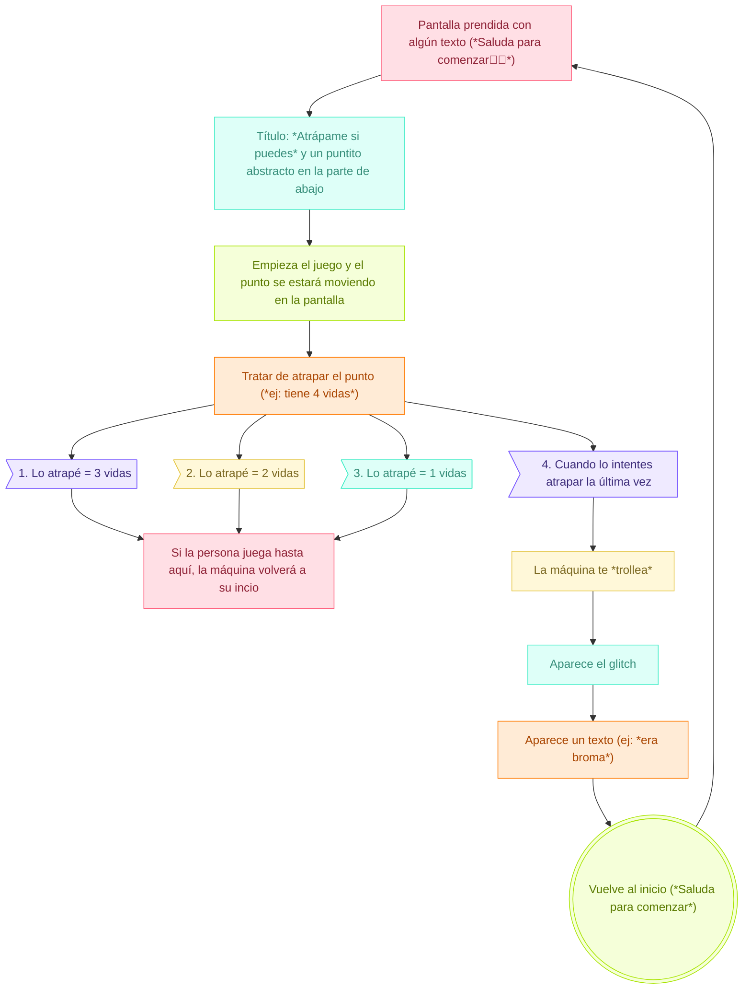

# sesion-15a

18-11-2025

## Apuntes

---

El viernes después de clases, mandé un mensaje muy largo por nuestro grupo en discord y ocurrieron cositas con el proyecto, nos dimos cuenta que en verdad ninguna estaba satisfecha al 100% con lo que estábamos haciendo, por lo que tratamos de darle otra vuelta al proyecto. Sentíamos que estábamos forzando el porqué del uso del sensor y la materialidad con las lanas.

Así que el día sábado y domingo no pusimos full con el proyecto y avanzamos lo más que podíamos (con lo que teníamos). Así que, esta es nuestra nueva propuesta:

---

MÁQUINA SENTIMENTAL "ATRÁPAME SI PUEDES"

`SENTIMIENTOS:`
- frustración
- dominar (tener el control)
- dirigir
- competitividad

`METÁFORA:`
- La máquina es una representación tecnológica del logro frustrado: esa sensación cotidiana en la que la promesa del éxito se rompe por un detalle mínimo. Al mismo tiempo, habla de la experiencia humana de perseguir algo que siempre se escapa: expectativas, logros, reconocimiento o metas personales y emocionales que parecen estar al alcance… pero nunca del todo. En ese juego constante entre deseo y evasión, la máquina encarna la relación desigual entre la intención humana y la respuesta arbitraria de un sistema. Una máquina que te hace sentir el delicado filo entre querer algo… y perderlo por un gesto mínimo.

`PRESENTACIÓN TEXTUAL`
- “Atrápame si puedes” es una máquina interactiva que funciona con gestos de la mano. El usuario mueve su mano frente a un sensor, y ese gesto controla un punto en una pantalla. El objetivo del juego es alcanzar un objeto que aparece en la pantalla.

Pero la máquina está diseñada para escaparse justo cuando estás a punto de atrapar el objetivo. Detecta tu cercanía y activa una especie de “glitch” o falla visual que hace que el objetivo huya. Esto provoca una mezcla de frustración y risa, porque el error no es real: la máquina te está troleando a propósito.

A veces te deja sumar puntos, otras veces te engaña, y te invita a seguir intentando con mensajes provocativos. La interacción crea una especie de competencia emocional entre el usuario y la máquina.

En resumen: es un juego que reconoce tus gestos, te hace creer que vas a ganar y luego se escapa, generando una experiencia divertida, frustrante y muy humana.

`BILL OF MATERIAL`

|Nombre componente|Característica|Cantidad|Especificaciones|
|---|---|---|---|
|Sensor de gestualidad|PAJ 7620|1|  Es capaz de reconocer 9 gestos en direcciones diferentes, que incluyen: arriba, abajo, izquierda, derecha, adelante, atrás, en sentido horario, antihorario y balanceo|
|Conversor de nivel lógico|I2C 5V a 3.3V|1|Este convertidor de nivel lógico bidireccional es la solución ideal para interconectar dispositivos que operan con diferentes voltajes, como 5V y 3.3V|
|Arduino Uno|R4 minima|1|Arduino UNO R4 Minima está armado con un potente microcontrolador de 32 bits|
|Pantalla|está en el lab|1|Hay que pedirla|
|Carcasa|Impresión 3D|1|Filamento: |
|Plinto| | | |
|Cables| | | |

`DIAGRAMA DE FLUJO`



`PSEUDOCÓDIGO`

```cpp
INICIAR variables:
    estado = "espera"
    puntaje = 0
    objetivo = posición_inicial

MIENTRAS el sistema esté encendido:
    
    leer gestos y distancia del usuario

    SI estado == "espera" Y el usuario se acerca:
        mostrar_mensaje("¿Vienes a perder?")
        estado = "invitación"

    SI estado == "invitación" Y el usuario hace el gesto de empezar:
        calibrar_controles()
        estado = "jugando"

    SI estado == "jugando":
        mover_cursor_segun_gestos()
        mover_objetivo_con_su_logica()

        SI el usuario está muy cerca de atrapar:
            decidir_si_trollear()

        SI el jugador atrapa el objetivo:
            SI hay_trolleo:
                hacer_glitch_y_huir()
                burlarse_del_usuario()
            SINO:
                sumar_puntos()
                mostrar_feedback_positivo()

                SI puntaje alcanza el mínimo para ganar:
                    estado = "victoria"

    SI estado == "victoria":
        SI hay_trolleo:
            hacer_glitch_y_huir()
            mostrar_mensaje("¿Pensaste que te dejaría ganar?")
            estado = "jugando"
        SINO:
            celebrar()
            reiniciar_juego()

    esperar_pequeño_momento()
```

---

### Comportamiento: qué hace, cómo lo hace y que sentimientos provoca

`Qué hace la máquina`

- Detecta presencia y gestos con el sensor PAJ7620
- La pantalla se prende con el puntito o destello en el medio. Te muestra un objeto (punto) en la pantalla y controlas el cursor con tus gestos
- El objetivo intenta escaparse cuando el sensor detecta que estás demasiado cerca de atraparlo
- Cuando se escapa activa un glitch visual.
- Repite el ciclo cada vez que estás por ganar
- La máquina se apaga cuando ya no detecta presencia

`Cómo lo hace`

- PAJ7620 provee vectores de gesto (dirección, velocidad, sí/no reconocimiento de gesto) y proximidad estimada; se usan para mapear la posición del cursor en la pantalla.

`Que sentimientos provoca`

- Frustración cómica: porque pierdes por un fallo artificial y reconocible (te ríes y te enojas a la vez).
- Competitividad y repetición: la necesidad de “hacerlo bien” hace que vuelvas a intentarlo.

`Cómo invita a jugar`

- Mensajes con texto provocativos: “¿Otra vez? Ven, hazlo mejor.” / “No te creas tan pro…”
- Sonido llamativo (sonido de inicio).

`Sensores`

- PAJ7620 — sensor de gestualidad (reconoce gestos, proporciona vectores de movimiento y proximidad relativa). Es core del control.

`Actuadores / salidas`

- Pantalla: monitor LCD/LED 1080p o pantalla vertical según diseño.
- Altavoces: efectos, música

`Controlador`

Arduino Uno R4 WiFi:
- Si es simple (gráficos vectoriales), Arduino R4 + pantalla posible pero con limitaciones.

`Inputs y outputs`

Inputs:
- Gestos (x,y,velocidad,gesto reconocido) — PAJ7620
- Distancia/proximidad — PAJ7620 
- Sonido ambiente (opcional mic)

Outputs:
- Cursor en pantalla (posición mapeada desde gesto)
- Objetivo/target (movimiento autónomo)
- Animaciones (glitch, escape, celebraciones)
- Audio: efectos y música

Estética visual:
- Paleta de colores: neón (magenta, cian, amarillo o verde)
- Tipografia: pixel-retro
- Máquina física: Pantalla en horizontal y por delante, pedestal con una caja que sostiene el sensor 

Forma de la gráfica:
- Cursor en forma de bolita con destellos que se está moviendo

---

`Sensor de gestualidad PAJ7620:`

- El sensor es diseñado para reconocer gestos con la mano, sin contacto. Usa tecnología óptica y un procesador interno que interpreta los movimientos.

`¿Cómo funciona el sensor?`

1. Un sensor óptico cercano a una cámara IR
    - Captura cambios de luz infrarroja cuando tu mano pasa frente al sensor
    - No obtiene imágenes completas, sino “patrones de movimiento”

2. Procesador interno
    - Analiza el movimiento detectado por el sensor
    - Compara el patrón con uno de sus gestos preprogramados
    - Envía el resultado por I2C al microcontrolador

3. Comunicación I2C
    - Dirección: 0x73
    - Solo usa SDA y SCL
    - El Arduino solo tiene que preguntar al sensor si detecto un gesto

`¿Que gestos puede detectar?`

El sensor detecta movimientos en el aire, entre 5-15 cm del sensor

1. Arriba
2. Abajo
3. Derecha
4. Izquierda
5. Avanzar (push)
6. Retroceder (pull)
7. RollOver (rotación circular)
8. Waving (saludo)

`¿Cómo lo interpreta el sensor?`

1. Tu mano pasa por el área del sensor
2. La luz IR rebota en la mano
3. El sensor detecta el movimiento como una variación progresiva
4. El motor de gestos compara la dirección y velocidad del cambio
5. Devuelve el código de gesto al microcontrolador 

|¿Cómo se conecta al arduino?|pin|
|---|---|
|VCC|-> 3.3V|
|GND|-> GND|
|SDA|-> SDA pin 20|
|SCL|-> SCL pin 21|

`Código básico para el sensor`

```cpp
#include <Wire.h>
#include "PAJ7620.h"

void setup() {
  Serial.begin(115200);
  Serial.println("Iniciando PAJ7620...");

  uint8_t error = paj7620Init();   
  if (error) {
    Serial.print("Error iniciando el sensor, código: ");
    Serial.println(error);
  } else {
    Serial.println("PAJ7620 listo!");
  }
}

void loop() {
  uint8_t gesture = paj7620ReadReg(0x43);  // Registro de gestos

  switch (gesture) {
    case GES_UP_FLAG:
      Serial.println("Arriba");
      break;
    case GES_DOWN_FLAG:
      Serial.println("Abajo");
      break;
    case GES_LEFT_FLAG:
      Serial.println("Izquierda");
      break;
    case GES_RIGHT_FLAG:
      Serial.println("Derecha");
      break;
    case GES_FORWARD_FLAG:
      Serial.println("Push / Adelante");
      break;
    case GES_BACKWARD_FLAG:
      Serial.println("Pull / Atras");
      break;
    case GES_CLOCKWISE_FLAG:
      Serial.println("Rollover horario");
      break;
    case GES_COUNT_CLOCKWISE_FLAG:
      Serial.println("Rollover antihorario");
      break;
    case GES_WAVE_FLAG:
      Serial.println("Wave (Agitar mano)");
      break;
  }

  delay(100);
}
```
