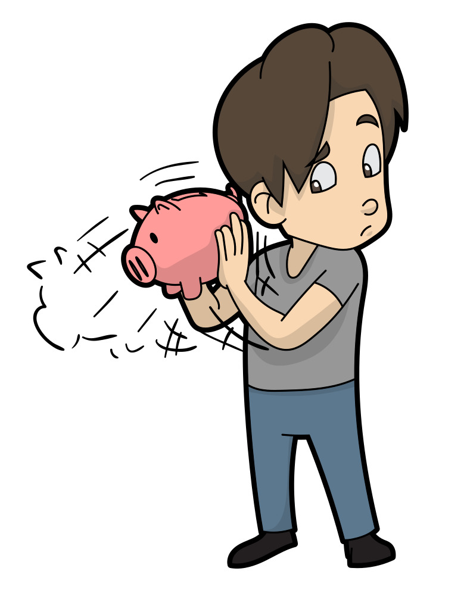

# sesion-13a

Qualcomm es una mega corporación de tecnología que compró a arduino.

Es como cuando Microsoft compró a Minecraft, para que entendamos la escala.

Admega3283 es un microcontrolador que se puede programar.

Mi celular es un procesador, mucho más potente y robusto que un controlador.

ml5.js es un machine learning para poder aplicarlo en sketches de p5.js.

Una pantalla para nosotros puede mostrar una imagen, mientras que para una máquina eso es unos tensores.

Me di cuenta de porqué Misaa siempre se equivoca en 1 cosa que le piden en los captchas que hacemos en clases, ya que el captcha sirve para entrenar la asociación de palabras con imágenes.

Stable difusión parte con un lienzo y lo llena con cosas random, un ruido, después empieza a compararlo con las imágenes que tiene para llegar a la imagen de una carretera.

TPU (Unidades de procesamiento Tensorial).

Gan (Generative Adversarial Network) Ian Goodfellow, es como el Alcara de la inteligencia artificial, porque no mejor tenemos 2 redes neuronales que peleen entre sí y vean cuál gana.

Casey Reas equipara las GAN a las cámaras en su momento, porque me permite generar imágenes con las que no necesito saber que es lo que está pasando adentro, también escribió un libro titulado: “making pictures with generative adversarial networks”.

Los datos son importantes.

Todo lo que Misaa sabe de IA es gracias a el siguiente canal: https://www.youtube.com/@3blue1brown/videos 

RNN (Red neuronal recurrente) 

Las palabras no existen en el vacío en el lenguaje, viven gracias al contexto.

Ojo con el "Snake oil” en la vida.

## Módulo despues del break

Mateo nos mostró su avance de su proyecto de título. 

OCR optical character recognition.

Google Collab es un préstamo de computadora.

Con un script de python Mateo creó un dataset de montones de Letras en afiches políticos, para generar afiches políticos generativos, para en un final llegar a escribir su memoria con una tipografía extraída de este proyecto completo.

Recorrer el espacio latente, alucinar.

Existe una herramienta llamada winget.

Pasamos al mundo de la consola, algo brutal que no fui capaz de seguir en vivo.

Revisión de nuestras ideas grupales, no nos fue muy bien porque las descripciones eran insuficientes, los profes no eran capaces de imaginarse nada de lo que pusimos.

Nos dieron algunas ideas que podríamos desarrollar como una máquina calculadora de delitos, una máquina que causaba estrés con headlines de noticias de Trump.

Pero personalmente no me convence, siento que realmente la manera en que nos dijeron esas máquinas eran 100% nuevas, no les podía ver una relación a ninguna de las ideas originales, así que me dispuse a hacer una investigación profunda sobre los temas que vamos a abordar.

Mateo especialmente si nos dio una muy buena idea sobre nuestro “Tamagotchi dependiente de música”, que no fuese específicamente música, por como sobretodo Aaron le parece complicado el definir qué es la música, donde podríamos hacer que el usuario tenga que seguir una secuencia, y que tal vez esta secuencia sea una melodía.

## Guión de introducción

*YRA PET es una máquina computacional donde puedes hacerte cargo de una mascota virtual, de ti depende tu bienestar.

*YRA, como todo ser vivo, es delicado, por favor atiendelo con cariño.

**NO** le apagues la luz, le tiene miedo a la oscuridad, **NO** lo muevas bruscamente, se puede golpear su cabeza, **NO** le dejes sólo, se pondrá triste.

Si es que le llegara a pasar algo a tu primer *YRA, otro eventualmente vendrá para llenar su vacío, pero debes asegurarte que no repetirás tus errores, **ningún *YRA sufrirá de la misma manera*** …

¿ ¿ ¿V E R D A D? ? ?

## Definición del sentimiento

Esta máquina computacional depende completamente de la conciencia ética y tristeza que pueden sentir los seres humanos.

Se aprovecha de estos sentimientos para que una mascota virtual pueda causar un potente sentimiento de culpa, al punto que se sienta mal consigo mismo.

## ¿Qué es lo que hace que *YRA será diferente a las demás mascotas virtuales?

La mascota virtual de mayor popularidad en el mercado son los **Tamagotchi**, donde se cuida de una criatura durante un periodo de tiempo de entre 3 a 7 días en algunas versiones, como también puede ser entre 10 a 25 días en otras, donde debes de jugar y limpiar sus desechos  entre otras cosas, para que su muerte sea por envejecimiento, no por negligencia o enfermedad.

Todas las razones por las que un Tamagotchi podría llegar a su final absoluto es por ignorancia en parte del dueño, ¿pero qué ocurriría si es que precisamente esta ignorancia fuese aún más terrible para la mascota, al punto en el que en menos de 10 minutos, ya estaría muerta?

Esa es precisamente la pregunta que *YRA pretende responder, mediante una serie de sensores con los que se puede interactuar de una manera más allá que simplemente mediante presionar botones, sino que es dependiente de cómo lo tratas en el ambiente exterior al mundo digital, después de todo, literalmente tienes a su completo mundo en sus manos.

Principalmente 2 sensores de harían cargo de esta interacción con el mundo real:  

- LDR el cual permite que a *YRA le llega luz para su mundo, como si fuera un agujero en el techo dejando que entre luz del sol durante el día en un cuarto cerrado, esto permite que su nictofobia(miedo a la oscuridad) no cause que su temor se apodere de su ser.

- Un Giroscopio que se asegurara que *YRA no es agitado ni tratado de manera brusca.

Estas no son simplemente una sugerencia, son obligaciones, *YRA morirá si es que no son tomadas en cuenta y consideradas con la mejor intención.

¿Y qué pasa si es que *YRA muere, te preguntaras?

## Culpa

*YRA se llama de esta manera porque tu mascota puede nacer con 25 distintos nombres, todos terminando en YRA.

TYRA, HYRA, UYRA, MYRA.

Todos nombres similares, por lo que te sentirás aún peor cuando eventualmente tu *YRA muera.

por

tu

culpa

Una vez, digamos que “TYRA” muera, tendrás que hacer 1 minuto real de silencio, donde en el display tan solo mostrará su lápida.

Pero cuando “SYRA” aparezca, te podrás olvidar de “TYRA” y seguir usando tu *YRA PET sin preocupaciones, verdad?

No, no podrás, recibirás constantes recuerdos cada pocos segundos de cómo dejaste morir a “TYRA”, o a todas las demás mascotas que en algún momento estaban **VIVOS**.

Eres una persona terrible, como es posible que dejaras que esto les pasará a los pobres *YRA.

## Máquina literal

Una consola portable, de tamaño y forma similar a una gameboy advance.

Tiene un display en las que se podrá observar todo lo necesario sobre tu *YRA PET.

En la parte superior de la consola tendrá el LDR.

En su lado izquierdo y derecho existirá un botón de una flecha apuntando hacia la dirección en la que está montada, no la munición, la forma geométrica la cual se puede asociar a un triángulo en conjunto a un rectángulo, específicamente como se puede observar en la siguiente imagen:

 
Los cambios del display respecto a su comunicación serán cada periodo de tiempo de aproximadamente 2 a 5 minutos.

Los cambios referentes a el LDR y el giroscopio sera instantaneo, donde *YRA sufrirá las consecuencias de tus acciones apenas ocurran, dándote no menos de 5 segundos, ni más que 20 segundos para actuar acorde al bienestar de *YRA.

## Componentes principales

Display, dependerá del tamaño que establezcamos para la máquina

LDR
https://afel.cl/products/pack-5-fotoresistores-gl5528-ldr?_pos=1&_sid=508143b6d&_ss=r

ÁNGULO DE ROTACIÓN
https://afel.cl/products/sensor-angulo-rotacion-cjmcu-103

ACELERÓMETRO 
https://afel.cl/products/sensor-acelerometro-gy-291-adxl345-3-ejes?pr_prod_strat=e5_desc&pr_rec_id=c81a06bbc&pr_rec_pid=8381999546520&pr_ref_pid=8381993943192&pr_seq=uniform

Arduino, para la programación del funcionamiento de *YRA.

LED, para demostrar que está prendida la consola.
