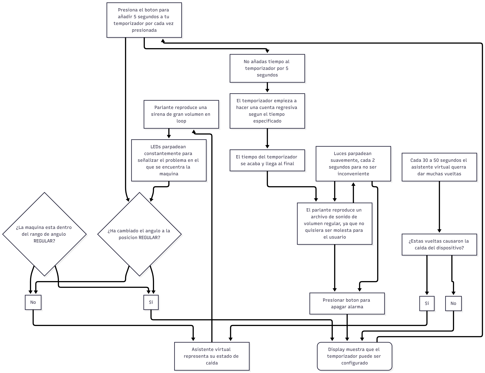
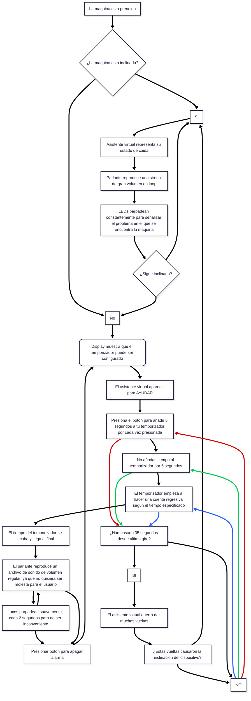

# sesion-14a

Hoy llegue a corregir un poco el diagrama de flujo ya que realmente estaba suuuuuuper enredado, le pedí ayuda a Mateo y Misaa, de cómo podría crear esta acción constante, donde la máquina cada 30 segundos empezará a “girar”.

Aquí está la 1ra versión hecha en Mermaid, que realmente es difícil de seguir ya que no tiene un punto de inicio claro.



Luego de ver esto, Janis me hizo la recomendación de copiar el código de mermaid directamente al Markdown, que realmente se ve mucho mejor.

También me puse a hacer prueba con mis compañeros de grupo, para que gracias a sus comentarios y su verdadero entendimiento de cómo iría a funcionar esta máquina, llegamos a un diagrama de flujo mucho más claro.

El 2do diagrama de flujo sería el siguiente:



También me puse a hacer prueba con mis compañeros de grupo, para que gracias a sus comentarios y su verdadero entendimiento de cómo iría a funcionar esta máquina, llegamos a un diagrama de flujo mucho más claro.

El 2do diagrama de flujo sería el siguiente:

(diagrama hecho con el código de mermaid)

Por mi parte me puse a probar 2 de los componentes más esenciales para nuestro proyecto, siendo el sensor tilt SW-520D y el motor.

Primero busque código de ejemplo del módulo SW-520D, encontrando uno que dejaba bastante claro su funcionamiento para mi a primera vista que puede ser encontrado aquí:

https://acortes.co/proyecto-21-sensor-de-inclinacion-sw-520d/

https://acortes.co/proyecto-21-sensor-de-inclinacion-sw-520d/

En realidad el sensor es relativamente fácil de usar, ya que no es dependiente de una biblioteca para su funcionamiento, simplemente hay que establecer su pin para que el arduino reciba una señal, y de esta manera, tomando el código de ejemplo que estaba en esa página web que es el siguiente:

```cpp
int pinSensor = 8;
int pinLed = 13;

void setup() 
{
  pinMode(pinSensor,INPUT);
  pinMode(pinLed,OUTPUT);
}

void loop() 
{
  if(digitalRead(pinSensor))
  {
    digitalWrite(pinLed,HIGH);
    delay(1000);
    digitalWrite(pinLed,LOW);
    delay(1000);
   }
   else
     digitalWrite(pinLed,LOW);
}

```
Lo modifique un poco para poder saber cual es la posición en la que se encuentra el sensor tilt con un mensaje en el monitor serial.

El código con mis modificaciones sería el siguiente:

``` cpp

// establecer el pin que sera conectado 
// el sensor para obtener su dato
int pinSensor = 8;
// crear una variable booleana para establecer 
// si hay inclinacion o no presente
bool parado;

// lo que es necesario para los funcionamientos en void loop
void setup() 
{
// establecer que el pin llamado pinSensor va a ser un input
  pinMode(pinSensor,INPUT);
// comenzar la comunicacion serial
  Serial.begin(9600);
}

// aqui ocurre todos los funcionamientos del codigo
void loop() 
{
  // si se recibe una señal desde el pinSensor
  if(digitalRead(pinSensor))
  {
    // significa que esta de lado
    parado = false;
     }
      else {
      // sino significa que esta parado
      parado = true;
       }

// si es que esta parado
if (parado){
  Serial.println("estoy hacia arriba");
  Serial.println(parado);
  delay(1000);
}
// si es que no esta parado
else if (!parado){
  Serial.println("estoy de lado");
  Serial.println(parado);
  delay(1000);
  }
}

```

Que en realidad, está sobre complejizado, la parte de la booleana que cree no era necesaria en absoluto, pero bueno, me entiendo y eso es lo importante.
