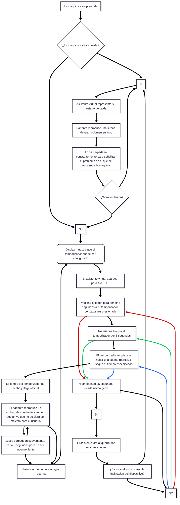

# sesion-14a

Hoy llegue a corregir un poco el diagrama de flujo ya que realmente estaba suuuuuuper enredado, le pedí ayuda a Mateo y Misaa, de cómo podría crear esta acción constante, donde la máquina cada 30 segundos empezará a “girar”.

Aqui esta la 1ra version hecha en Mermaid, que también tiene errores ortograficos:

