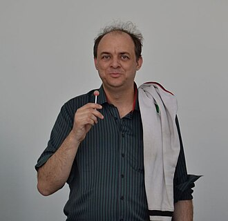

# sesion-11b

## Apuntes
###### ${\color{#3d3d44}Se \ recomienda \ usar \ modo \ oscuro, \ hay \ palabras \ en \ color \ blanco \ que \ de \ otra \ forma \ no \ son \ visibles.}$  
###### ${\color{#3d3d44}The \ use \ of \ dark mode \ is \ recommended, \ there's \ white \ colored \ text \ that \ otherwise \ is \ not \ visible.}$  

### [Object Oriented Design (OOD)](https://www.geeksforgeeks.org/system-design/oops-object-oriented-design/)

Es una forma de diseñar y programar software, pensando en todos los elementos que componen nuestro sistema como objetos y clases interelacionados, lo cual resulta en un sistema modular altamente adaptable y facil de comprender.

### [Object Oriented Ontology (OOO)](https://oxfordre.com/literature/display/10.1093/acrefore/9780190201098.001.0001/acrefore-9780190201098-e-997) 

Movimiento filosofico que argumenta que todo lo existente son objetos, desde elementos físicos a ideas; y que estos objetos existen independientemente de nuestra percepción, tienen una realidad propia y una escencia oculta a a cual ningun otro objeto puede acceder, por lo que es imposible conocer o develar realmente lo que un objeto es.

Es similar a la física cuántica, en que no se puede saber nada realmente mediante la observación.

> #### [Graham Harman](https://es.wikipedia.org/wiki/Graham_Harman)
> 
>
> Filosofo Estadounidense cuyo trabajo origino la ontologia orientada a objetos.
>
> Es parte del realismo especulativo, se opone a la idea de que la unica forma en que se puede entender el mundo es mediante nuestra relacion con él, argumentando que los objetos existen independientemente de nuestra percepción de estos.  

### Metafora

Son la conexión entre dos características no escenciales de un objeto

    Ej: Handschuh == Zapato de mano (aleman)

### Galería Gabriela Mistral

Fuimos a ver y oir la obra "Decantaciones y Resonaciones ¿Dónde nace y termina el rumor del rio?", de la artista Claudia González Godoy.

La instalacion nos pone en una habitación con harta tierra y un pequeño estanque con agua ubicado en el centro, nos hicieron quitarnos los zapatos para sentir mejor las vibraciones del suelo.

La obra trata sobre las alteraciones que se le han hecho al rio Biobio y el efecto que han tenido, reteniendo el flujo de agua y eliminando el sonido del agua al correr. 

Durante la experiencia a veces sentiamos el suelo vibrar y escuchabamos sonidos de agua corriendo, con espacios de silencio y quietud diseñados para contrastar el antes y después de la intervención humana.

### Other things: <!-- Things to organize + random stuff -->
> ### SUB_SUBTITULO

-----------------------------------------------------------------------------------------------------------
## Encargo 17 <!-- subir una investigación detallada de la obra artística de Claudia González Godoy, con énfasis en su investigación sobre ríos, incluyendo información sobre premios, exposiciones, colaboradores, estudios y referencias en su obra. -->
### TITULO

-----------------------------------------------------------------------------------------------------------
## Encargo 18 <!-- subir taxonomía detallada de sensores, actuadores, software y hardware utilizado en 1 obra exhibida en la Bienal de Artes Mediales 2025, citando correctamente a las fuentes. -->
### TITULO